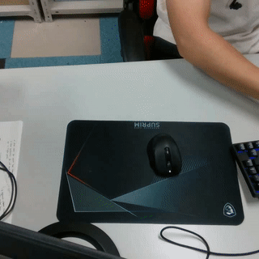
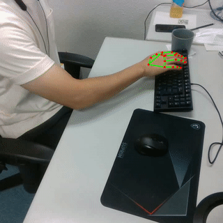
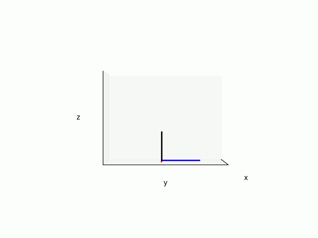

**Real time 3D hand pose estimation using MediaPipe**

This is a demo on how to obtain 3D coordinates of hand keypoints using MediaPipe and two calibrated cameras. Two cameras are required as there is no way to obtain 3D coordinates from a single camera. Check here: [stereo calibrate](https://github.com/TemugeB/python_stereo_camera_calibrate) for a calibration package. Also my blog post on how to stereo calibrate two cameras: [link](https://temugeb.github.io/opencv/python/2021/02/02/stereo-camera-calibration-and-triangulation.html). Alternatively, follow the camera calibration at Opencv documentations: [link](https://docs.opencv.org/3.4/d9/d0c/group__calib3d.html). If you want to know some details on how this code works, take a look at my accompanying blog post here: [link](https://temugeb.github.io/python/computer_vision/2021/06/27/handpose3d.html).

  


**MediaPipe**  
Install mediapipe in your virtual environment using:
```
pip install mediapipe
```

**Requirements**  
```
Mediapipe
Python3.8
Opencv
matplotlib
pyrealsense2 # for depth mode
```

**Usage: Getting real time 3D coordinates**  
As a demo, I've included two short video clips and corresponding camera calibration parameters. Simply run as:
```
python handpose3d.py
```
If you want to use webcam, call the program with camera ids. For example, cameras registered to 0 and 1:
```
python handpose3d.py 0 1
```
Make sure the corresponding camera parameters are also updated for your cameras.

The 3D coordinate in each video frame is recorded in ```frame_p3ds``` parameter. Use this for real time application. If keypoints are not found, then the keypoints are recorded as (-1, -1, -1). **Warning**: The code also saves keypoints for all previous frames. If you run the code for long periods, then you will run out of memory. To fix this, remove append calls to: ```kpts_3d, kpts_cam0. kpts_cam1```. When you press the ESC key, hand keypoints detection will stop and three files will be saved to disk. These contain recorded 2D and 3D coordinates. 

**Usage: Depth-based 3D lifting with RealSense**
```
python handpose3d/handpose3d.py --mode depth
```
This reads aligned color/depth frames from detected RealSense cameras, runs MediaPipe on the color image, and lifts each 2D landmark to camera-local 3D using depth. During execution, both the color view and a live 3D skeleton view are shown. A palm 6D pose based on wrist + MCP landmarks is also estimated and rendered. Use `--serials <serial0> <serial1>` to pin specific cameras. The script writes per-camera files such as `kpts_<serial>_2d.dat`, `kpts_<serial>_3d_depth.dat`, and `palm_pose_<serial>.dat`.

**Usage: RealSense + YOLOE segmentation check**
```
python object_pt_extraction/realsense_yoloe_seg_demo.py --model yoloe-26m-seg.pt --show-depth
```
This opens a live RealSense color stream, runs Ultralytics segmentation on each frame, and overlays masks, boxes, FPS, and inference latency. If you use a different weights file or model alias, pass it through `--model`. Use `--serial <serial>` to select a specific RealSense device.

**Usage: RealSense mask to point cloud**
```
python object_pt_extraction/realsense_mask_pointcloud_demo.py --model yoloe-26m-seg.pt --prompt bottle --select-mode highest_score --show-depth
```
This runs segmentation on the live RealSense color stream, converts the selected mask region into a depth-based point cloud, and shows a simple point-cloud preview. Press `s` to save the current snapshot as `.npy`, `.ply`, overlay image, and mask image under `outputs/pointcloud_demo/`.

**Usage: Dual RealSense local point clouds**
```
python object_pt_extraction/realsense_dual_mask_pointcloud_demo.py --model yoloe-26m-seg.pt --prompt bottle --select-mode highest_score --show-depth
```
This initializes two RealSense cameras, pairs frames by nearest timestamp, and builds a local point cloud for each camera independently. It also transforms the non-target camera cloud into the target camera frame using the saved extrinsics, so you can compare local and aligned previews side by side. Use `--camera-ids 0 1` to map serial order to calibration ids, and press `s` to save both local clouds plus the transformed cloud under `outputs/dual_pointcloud_demo/`.

**Usage: Visualizing depth-based 3D hand pose**
```
python handpose3d/show_depth_hands.py kpts_<serial>_3d_depth.dat
```

**Usage: Validating depth-based 3D hand pose**
```
python handpose3d/validate_depth_pose.py kpts_<serial>_3d_depth.dat
```
For static validation, record a short segment while holding the hand still, then optionally limit the check to that interval with `--start-frame` and `--end-frame`.

**Usage: Viewing 3D coordinates**  
The ```handpose3d.py``` program creates a 3D coordinates file: ```kpts_3d.dat```. To view the recorded 3D coordinates, simply call:
```
python handpose3d/show_3d_hands.py
```
