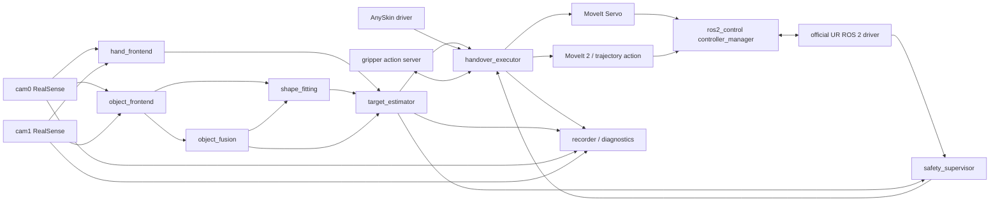
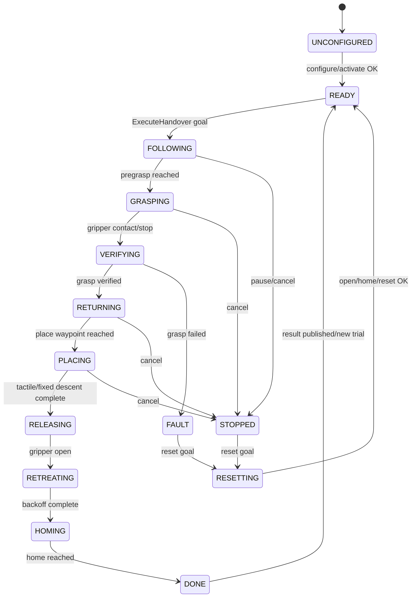
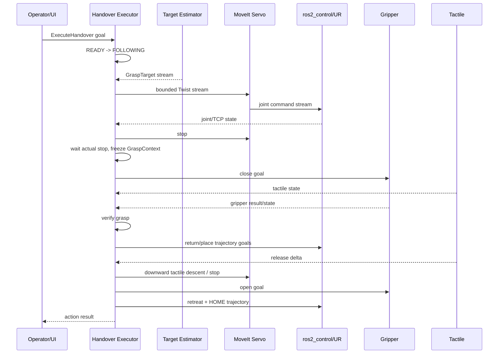

# ICRA Handover 시스템 ROS 2 전환 계획

## 1. 문서 목적

현재 시스템의 실행 진입점은 [`robot_control_rtde_fitting_final.py`](../robot_control_rtde_fitting_final.py)이며, 한 프로세스 안에서 다음 기능을 수행한다.

- 듀얼 RealSense RGB-D 입력과 근사 시간 동기화
- 카메라별 물체 segmentation 및 3D point cloud 생성
- 카메라별 손 검출, 3D lifting, active hand 선택
- 물체 cloud 병합, template shape fitting, silhouette 보정
- grasp target 생성, dropout fallback, target prediction 및 안정화
- `RobotWorker` 상태 머신을 통한 follow, grasp, return, place, reset
- UR RTDE 제어, Robotiq gripper, AnySkin tactile 처리
- 영상, metadata, 3D debug, runtime profile 저장

이 문서는 위 기능을 ROS 2의 node, topic, service, action, TF, lifecycle로 재구성하는 전체 설계안이다. 구현 세부 코드보다는 모듈 경계, 메시지 계약, 제어권, 안전 정책과 단계별 전환 순서에 초점을 둔다.

## 2. 먼저 합의할 전제

### 2.1 ROS 2는 RTDE의 대체 프로토콜이 아니다

ROS 2는 node 사이의 통신과 실행 구조를 제공하는 미들웨어이다. UR 로봇과 실제로 통신하려면 여전히 하위 hardware driver가 필요하다. 권장 구조는 애플리케이션에서 `RtdeController`를 제거하고, 공식 `ur_robot_driver`와 `ros2_control` 인터페이스만 사용하는 것이다.

공식 UR ROS 2 driver 자체는 내부적으로 RTDE recipe와 Reverse Interface/URScript를 사용한다. 따라서 아래 두 의미를 구분해야 한다.

- 권장 의미: handover 애플리케이션이 RTDE API와 socket을 직접 호출하지 않는다.
- 엄격한 의미: UR driver 내부에서도 RTDE를 전혀 사용하지 않는다. 이 경우 공식 driver를 사용할 수 없어 별도의 산업용 통신/컨트롤러 설계가 필요하며, 이 프로젝트 범위를 크게 벗어난다.

이 문서는 첫 번째 의미를 기본안으로 사용한다.

### 2.2 “Python 제거”의 권장 해석

현재 PC에는 ROS 2 Humble이 설치되어 있다. 최종 handover runtime의 자체 node는 C++17과 `rclcpp`로 구현하는 것을 권장한다. 다만 ROS 2 CLI나 일부 launch 도구 자체에는 Python이 포함될 수 있으므로, 목표는 “애플리케이션 알고리즘과 제어 로직에서 Python runtime 제거”로 정의하는 것이 현실적이다.

기존 YOLOE/Ultralytics, MediaPipe, Open3D Python 구현은 다음 경로로 옮긴다.

- object segmentation: ONNX Runtime 또는 TensorRT C++ engine으로 변환
- hand pose: MediaPipe C++ graph 또는 검증된 ONNX/TensorRT hand model
- point cloud/ICP: Open3D C++ 또는 PCL/Eigen
- 나머지 filtering, selection, grasp planning: Eigen 기반 C++ 이식

전환 기간에는 기존 Python 결과를 offline oracle로만 사용하고, 최종 runtime graph에는 포함하지 않는다.

### 2.3 기본 ROS 배포판

- 현재 장비를 그대로 쓰는 1차 구현: ROS 2 Humble / Ubuntu 22.04
- 새 OS 설치가 가능한 장기 배포: ROS 2 Jazzy / Ubuntu 24.04도 검토
- 한 배포판을 선택한 뒤 UR driver, MoveIt 2, RealSense driver와 message 정의 버전을 `.repos`와 container image로 고정한다.

Humble과 Jazzy 코드를 동시에 지원하려고 추상화부터 만들지는 않는다. 실제 배포판 하나를 먼저 고정하는 편이 안전하다.

## 3. 설계 원칙

1. 모든 ROS geometry 단위는 meter, radian, second를 사용한다. 현재 코드의 mm 내부 표현은 제거한다.
2. 모든 3D 값은 `header.frame_id`와 acquisition timestamp를 가진다.
3. 좌표 변환은 `tf2`만 사용한다. `position_signs: [-1, -1, 1]` 같은 수동 축 보정은 최종 구조에서 제거한다.
4. 로봇과 gripper의 motion command는 오직 `handover_executor`만 소유한다.
5. 연속 데이터는 topic, 즉시 끝나는 설정은 service, 취소/feedback이 필요한 동작은 action으로 표현한다.
6. target을 받지 못한 상태는 “마지막 명령 유지”가 아니라 timeout 후 정지로 정의한다.
7. perception과 robot control의 상태 머신을 분리한다. perception dropout이 task state를 암묵적으로 바꾸지 않는다.
8. 큰 이미지와 point cloud를 다루는 perception node는 component container와 intra-process 통신을 우선 사용한다.
9. safety 판단은 정상 제어 경로와 별도 node에서 감시하되, 인증된 E-stop을 ROS topic으로 대체하지 않는다.
10. 각 단계는 rosbag replay, fake hardware, URSim, 실제 장비 순서로 검증한다.

## 4. 권장 전체 구조



핵심 경로는 다음과 같다.

```text
RGB-D -> object/hand inference -> fusion/shape fitting -> grasp target
      -> handover executor -> MoveIt Servo 또는 trajectory action
      -> ros2_control -> UR driver -> robot
```

## 5. Node 구성

### 5.1 Hardware 및 sensor layer

#### `/cam0/camera`, `/cam1/camera`

- 구현: `realsense2_camera`의 두 독립 프로세스
- 역할: color, aligned depth, camera info 발행
- namespace로 serial과 frame 이름을 분리한다.
- 한 카메라 오류가 다른 카메라 프로세스를 죽이지 않도록 별도 프로세스를 권장한다.
- 현재 `DualSensorHub`의 depth spatial/temporal/hole-filling 설정은 driver parameter로 최대한 옮긴다.
- OpenCV bilateral filter처럼 driver 밖의 처리가 필요하면 `rgbd_preprocessor` component에서 수행한다.

주요 출력:

- `/cam0/color/image_raw`
- `/cam0/aligned_depth_to_color/image_raw`
- `/cam0/color/camera_info`
- cam1도 동일한 namespace 사용

두 카메라의 네 image stream을 하나의 거대한 custom message로 재발행하지 않는다. perception component가 `message_filters::ApproximateTime`으로 동기화하며, 현재 허용값 `0.03 s`를 parameter로 유지한다.

#### `/tactile/anyskin_driver`

- 기존 `AnySkinTactileManager`를 대체하는 C++ lifecycle node
- serial port 연결, baseline 초기화, raw magnetometer 읽기, norm 계산 담당
- contact/release 판정의 원본 데이터만 발행하고, task 문맥에 따른 최종 판정은 `handover_executor`가 담당한다.
- stale timeout과 serial reconnect 상태를 diagnostics로 발행한다.

출력:

- `/tactile/state` (`handover_interfaces/msg/TactileState`)
- `/diagnostics`

service:

- `/tactile/reset_baseline` (`std_srvs/srv/Trigger`)

#### `/gripper/gripper_controller`

최종안은 Robotiq를 `ros2_control` hardware interface로 노출하고 표준 `control_msgs/action/GripperCommand`를 제공하는 것이다.

- goal별 위치와 최대 힘 명령; 속도는 controller parameter로 설정
- 실제 position/current/fault feedback
- activate/reconnect 처리
- 명령 timeout과 cancel 지원

goal마다 속도를 바꿔야 한다면 표준 action을 억지로 확장하지 않고 별도 Robotiq action을 정의한다.

사용 중인 Robotiq daemon port `63352`만 가능한 경우에는 C++ socket bridge를 action server로 먼저 구현할 수 있다. 이 경우에도 socket 소유권은 이 node에만 두고, `handover_executor`는 action만 사용한다.

#### 공식 UR driver 및 `controller_manager`

- `ur_robot_driver`
- `joint_state_broadcaster`
- `force_torque_sensor_broadcaster`
- `scaled_joint_trajectory_controller`
- 필요 시 MoveIt Servo 출력용 controller

애플리케이션 node는 robot IP, dashboard port, RTDE recipe에 직접 접근하지 않는다. UR calibration을 추출하여 실제 robot kinematics와 URDF가 일치하는지 확인한다.

### 5.2 Perception layer

#### `/perception/object_frontend`

현재 모듈:

- `ObjectWorkerCam0`, `ObjectWorkerCam1`
- `SegmentationEngine`
- mask 기반 point cloud 추출과 per-camera filtering
- `HandednessAwareObjectClassLock`의 inference filter 부분

입력:

- 두 카메라의 color/depth/camera_info
- `/perception/class_lock`

출력:

- `/perception/object/cam0/observation`
- `/perception/object/cam1/observation`
- `/perception/object/cam0/cloud`
- `/perception/object/cam1/cloud`
- `/perception/object/cam0/mask`, `/perception/object/cam1/mask`

하나의 GPU model instance를 두 카메라가 공유하고, inference queue는 bounded latest-frame policy를 쓴다. 처리 지연이 생겼을 때 오래된 frame을 순서대로 모두 처리하지 않는다.

#### `/perception/hand_frontend`

현재 모듈:

- `HandWorkerCam0`, `HandWorkerCam1`
- MediaPipe hand detection/tracking
- depth lifting, palm center/normal, velocity

출력:

- `/perception/hand/cam0/observation`
- `/perception/hand/cam1/observation`

각 candidate에 camera frame 또는 base frame을 명확히 넣는다. 권장안은 node 내부에서 measurement timestamp의 TF를 조회해 `base` frame으로 변환한 뒤 발행하는 것이다.

#### `/perception/object_fusion`

현재 `ObjectMerger`를 대체한다.

- cam0/cam1 observation freshness 확인
- base frame point cloud 병합
- voxel downsample/outlier filtering
- initial centroid와 lift height 계산

출력:

- `/perception/object/merged`
- `/perception/object/merged_cloud`

#### `/perception/shape_fitting`

현재 `ShapeFittingTrackerV2`와 silhouette constraint를 대체한다.

- template selection
- scale initialization
- cluster 선택과 temporal tracking
- ICP
- 양 카메라 mask를 이용한 silhouette rerank
- fitted pose, scale, confidence, template axes, bottom height 계산
- grasp 단면의 예상 object width 계산

출력:

- `/perception/object/shape`
- `/perception/object/fitted_cloud`는 debug가 켜진 경우에만 발행

중요하게, 제어 node에 fitted point cloud 전체를 넘기지 않는다. 현재 `RobotActionContext`가 cloud를 받아 gripper threshold를 계산하는 기능은 이 node에서 미리 계산한 `estimated_grasp_width_m` scalar로 바꾼다.

#### `/perception/target_estimator`

현재 다음 모듈을 한 logical component로 묶는다.

- `HandSelector`
- `HandednessAwareObjectClassLock`의 선택 상태
- `PerceptionFusion`
- `GraspTargetPlanner`
- `GraspPointZStabilizer`
- `HandRelativeFallbackTracker`
- `TargetPredictor`
- `FollowSharedState`의 perception 관련 filtering/arming 로직

입력:

- merged object/shape estimate
- cam0/cam1 hand observation
- robot TCP pose
- task phase와 task ID

출력:

- `/perception/selected_hand`
- `/perception/fusion_state`
- `/handover/grasp_target`
- `/perception/class_lock`

`GraspTarget`에는 measured, hand fallback, predicted source를 명시한다. `header.stamp`는 원 sensor measurement 시각이고 `generated_stamp`는 target 계산 완료 시각이다. executor는 두 값으로 sensor age와 processing latency를 구분한다.

### 5.3 Task/control layer

#### `/handover/executor`

현재 `RobotWorker`와 `FollowSharedState`의 control 관련 기능을 대체하는 C++ lifecycle node이자 action server이다.

책임:

- 전체 handover 상태 머신
- robot/gripper command 단일 소유권
- grasp target freshness, valid streak, motion trigger 확인
- follow 중 reference target의 속도 제한과 workspace clamp
- pregrasp 도달 판정
- grasp 시점의 geometry/target/place context 동결
- gripper close와 tactile/force/current 기반 grasp 검증
- return, place, tactile descent, release, retreat, HOME
- reset, cancel, software stop
- 상태/feedback/event 발행

인터페이스:

- action server `/handover/execute`
- action server `/handover/reset`
- service `/handover/set_follow`
- service `/handover/software_stop`
- topic `/handover/status`
- topic `/handover/events`

이 node 이외의 자체 node는 MoveIt Servo command, trajectory goal, gripper goal을 보내면 안 된다. `safety_supervisor`도 로봇에 직접 명령하지 않고 executor의 stop 경로를 호출한다.

#### Live follow 구현

1차 권장안은 MoveIt Servo를 사용한다.

- executor는 target pose와 current TCP pose 차이로 bounded Cartesian velocity를 계산한다.
- `geometry_msgs/msg/TwistStamped`를 MoveIt Servo에 30 Hz로 보낸다.
- MoveIt Servo가 IK, joint limit, singularity, collision check를 담당한다.
- 기존 `MAX_XY_SPEED_MM_S=250`, `MAX_Z_SPEED_MM_S=250`은 각각 `0.25 m/s` parameter로 옮긴다.
- target age가 timeout을 넘거나 state guard가 깨지면 zero/stop command를 보내고 Servo를 멈춘다.

MoveIt Servo의 jitter/latency가 실제 측정 기준을 만족하지 못할 때만 2차안으로 custom `ros2_control` controller plugin을 구현한다. 이 plugin은 최신 target을 realtime buffer로 받고 controller update loop에서 IK/velocity limiting을 수행한다.

#### HOME/return/place 구현

- HOME: `control_msgs/action/FollowJointTrajectory`
- Cartesian return/place/backoff: MoveIt 2의 collision scene과 Cartesian/LIN plan 사용
- 직선 경로 보장이 필요하면 Pilz LIN planner 또는 검증된 Cartesian waypoint trajectory 사용
- trajectory 완료는 action result뿐 아니라 joint/TCP tolerance와 actual speed로 재확인
- follow와 trajectory를 동시에 실행하지 않는다. Servo를 stop하고 actual speed가 threshold 아래임을 확인한 뒤 trajectory goal을 보낸다.

#### `/handover/safety_supervisor`

입력:

- handover status/target
- joint state, TCP pose/wrench
- UR safety/robot mode
- controller state
- tactile health
- node heartbeat/diagnostics

감시 항목:

- workspace와 joint limit
- target freshness와 command watchdog
- perception heartbeat
- controller/driver disconnect
- robot protective stop/safety mode
- unexpected controller switch 또는 다중 command publisher
- tactile descent의 minimum Z

이 node가 발행하는 software stop은 인증된 emergency stop이 아니다. 사람과 로봇의 안전은 UR safety configuration, 물리 E-stop, speed/force limit, risk assessment가 최종 방어선이다.

### 5.4 Logging 및 UI layer

#### `/handover/recorder`

현재 `HandoverMetadataRecorder`, `Debug3DRecorder`, `RuntimeProfiler`, `HandoverVideoRecorderService`를 ROS-native 방식으로 대체한다.

- `rosbag2`로 sensor, target, state, TF, tactile 기록
- task ID와 event 기반 metadata JSON/CSV 생성
- image는 `image_transport` compressed transport 선택 가능
- `/diagnostics`와 timing statistics 기록
- task start/done/reset action event를 기준으로 bag split/save/discard

기존 web UI가 반드시 필요하면 recorder만 별도 web process로 두고 ROS service/action client로 연결한다. 로봇 제어 process 안에 web server를 넣지 않는다.

#### `/handover/operator_ui`

현재 `f`, `r`, `s`, `d`, `q` 키를 service/action으로 치환한다.

| 기존 입력 | ROS 2 동작 |
|---|---|
| `f` | `/handover/set_follow` |
| `r` | `/handover/reset` action |
| `s` | recorder finalize service 후 follow stop |
| `d` | debug bag snapshot/finalize 후 reset |
| `q` | lifecycle deactivate/shutdown |

초기에는 CLI client로 충분하며, 이후 RViz panel 또는 Qt UI를 추가한다.

## 6. 현재 코드와 ROS 2 node 매핑

| 현재 코드 | ROS 2 대상 |
|---|---|
| `DualSensorHub` | 두 `realsense2_camera` node + ApproximateTime sync |
| `ObjectWorkerCam0/1` | `object_frontend` component |
| `HandWorkerCam0/1` | `hand_frontend` component |
| `ObjectMerger` | `object_fusion` component |
| `ShapeFittingTrackerV2` | `shape_fitting` component |
| `HandSelector` | `target_estimator` component |
| `PerceptionFusion` | `target_estimator` component |
| `GraspTargetPlanner` | `target_estimator` component |
| `GraspPointZStabilizer` | `target_estimator` component |
| `HandRelativeFallbackTracker` | `target_estimator` component |
| `TargetPredictor` | `target_estimator` component |
| `FollowSharedState` | typed topics + executor 내부 state/cache |
| `RobotWorker` | `handover_executor` lifecycle/action node |
| `RtdeController` | 공식 UR driver + `ros2_control` + MoveIt 2 |
| `robotiq_gripper*` | gripper hardware interface/action server |
| `AnySkinTactileManager` | `anyskin_driver` lifecycle node |
| video/metadata/debug/profile | recorder, rosbag2, diagnostics |
| OpenCV keyboard UI | CLI/RViz/Qt action client |

## 7. ROS interface 설계

표준 message를 우선 사용한다.

- image/intrinsics: `sensor_msgs/Image`, `sensor_msgs/CameraInfo`
- cloud: `sensor_msgs/PointCloud2`
- robot: `sensor_msgs/JointState`, `geometry_msgs/PoseStamped`, `geometry_msgs/WrenchStamped`
- TF: `geometry_msgs/TransformStamped`, `/tf`, `/tf_static`
- trajectory: `control_msgs/action/FollowJointTrajectory`
- gripper: `control_msgs/action/GripperCommand`
- diagnostics: `diagnostic_msgs/DiagnosticArray`

프로젝트 전용 interface는 별도 `handover_interfaces` package에 둔다.

### 7.1 핵심 custom message

#### `ObjectObservation.msg`

```text
std_msgs/Header header
uint64 frame_seq
uint8 camera_id
bool valid
string label
float32 confidence
geometry_msgs/Point centroid
uint32 point_count
```

mask와 cloud는 같은 `header.stamp`/`frame_seq`를 가진 별도 표준 topic으로 발행한다. state consumer가 cloud가 필요하지 않을 때 대용량 데이터를 받지 않게 하기 위함이다.

#### `HandCandidate.msg`, `HandObservation.msg`

```text
# HandCandidate.msg
string candidate_id
string handedness
float32 confidence
geometry_msgs/Point palm_center
geometry_msgs/Vector3 palm_normal
geometry_msgs/Point wrist
geometry_msgs/Vector3 velocity

# HandObservation.msg
std_msgs/Header header
uint64 frame_seq
uint8 camera_id
bool valid
HandCandidate[] candidates
```

#### `ShapeEstimate.msg`

```text
std_msgs/Header header
uint64 frame_seq
bool valid
string label
string template_id
geometry_msgs/Pose pose
geometry_msgs/Vector3 scale_xyz
float32 tracking_confidence
float32 mask_iou
float32 depth_inlier_ratio
float32 template_bottom_z
float32 estimated_grasp_width_m
uint8 tracking_mode
string reinit_reason
```

#### `GraspTarget.msg`

```text
uint8 SOURCE_MEASURED=0
uint8 SOURCE_HAND_FALLBACK=1
uint8 SOURCE_PREDICTED=2

std_msgs/Header header
builtin_interfaces/Time generated_stamp
uint64 task_id
bool valid
geometry_msgs/Pose target_pose
geometry_msgs/Point object_center
string object_label
float32 estimated_grasp_width_m
float32 template_bottom_z
uint8 source
float32 confidence
uint32 valid_streak
bool motion_triggered
bool hand_approach_latched
```

executor는 cloud나 UI overlay를 참조하지 않고 이 message만으로 follow 여부를 결정할 수 있어야 한다.

#### `TactileState.msg`

```text
std_msgs/Header header
bool valid
bool baseline_ready
float32[] raw_values
float32[] baseline_subtracted_values
float32 total_norm
float32 release_delta
uint32 sample_seq
string error
```

#### `HandoverStatus.msg`

```text
std_msgs/Header header
uint64 task_id
uint8 phase
bool follow_enabled
bool target_fresh
bool robot_connected
bool grasp_verified
bool cancel_pending
string active_action
uint16 error_code
string error_message
```

phase와 error code는 message constant로 정의하고 문자열 비교를 제어 로직에서 제거한다.

### 7.2 Action과 service

#### `ExecuteHandover.action`

```text
# Goal
uint64 requested_task_id
bool start_follow_immediately
---
# Result
bool success
uint64 task_id
uint16 result_code
string message
---
# Feedback
uint8 phase
float32 target_age_sec
float32 tcp_target_error_m
bool grasp_verified
string detail
```

goal 하나가 READY부터 follow, grasp, return, place, HOME까지의 한 handover trial을 나타낸다. action cancel은 현재 blocking helper의 `cancel_event`를 대체한다.

#### `ResetHandover.action`

reset은 gripper open과 HOME 이동을 포함할 수 있으므로 service가 아니라 action으로 둔다.

```text
# Goal
bool open_gripper
bool move_home
---
# Result
bool success
string message
---
# Feedback
uint8 phase
string detail
```

짧은 제어는 service로 둔다.

- `SetFollow.srv`: enable/disable, 현재 phase와 거부 사유 반환
- `SoftwareStop.srv`: stop 요청 접수 여부 반환
- `FinalizeRecording.srv`: save/discard와 task ID

## 8. Topic 이름과 QoS

| Topic 종류 | 권장 QoS | 이유 |
|---|---|---|
| raw image/depth/camera_info | SensorDataQoS, best effort, depth 2~5 | 최신 frame 우선, backlog 방지 |
| mask/point cloud | best effort, keep last 1 | 크고 재전송보다 freshness가 중요 |
| hand/object/shape state | best effort, keep last 1~3 | frame 기반 연속 state |
| grasp target | best effort, keep last 1 | stale target 재생 방지; timestamp watchdog 필수 |
| joint/TCP/tactile state | SensorDataQoS 또는 local reliable | 고주기 state, 실제 주파수 측정 후 결정 |
| handover status/event | reliable, keep last 10 | 상태 전이 유실 방지 |
| 최종 status snapshot | reliable + transient local, depth 1 | 늦게 붙은 UI/recorder도 현재 상태 수신 |
| service/action | ROS 2 기본 reliable | 명령, result, cancel 보장 |
| `/tf_static` | transient local | 표준 TF 정책 |

best effort target을 쓰더라도 안전이 delivery에 의존해서는 안 된다. executor는 `header.stamp`, maximum age, deadline callback과 자체 watchdog으로 target 유실을 판단한다.

## 9. TF와 calibration

권장 TF tree 예시는 다음과 같다.

```text
world (optional)
└── base
    ├── cam0_link
    │   └── cam0_color_optical_frame
    ├── cam1_link
    │   └── cam1_color_optical_frame
    └── base_link -> ... -> tool0 -> tcp -> gripper/tactile frames
```

실제 UR driver의 `base`, `base_link`, `tool0` 관계를 그대로 사용하고, perception 기준 frame은 parameter로 하나만 고정한다.

현재 calibration chain:

```text
cam1 -> cam0 -> robot base
```

전환 절차:

1. 현재 `c0_to_robot.pckl`, `rot_trans_c1.dat`를 읽는 one-time 변환 도구를 만든다.
2. translation/rotation 방향과 optical frame convention을 시각적으로 검증한다.
3. 결과를 static TF용 YAML/xacro로 저장한다.
4. checkerboard 또는 known point를 양 카메라에서 base로 변환하여 오차를 수치화한다.
5. `frame_mapping.position_signs` 없이 같은 base 좌표가 나오는지 확인한다.
6. 각 point/pose는 measurement timestamp 기준 `tf2` lookup으로 변환한다.

TF가 없거나 오래됐을 때 최신 TF를 임의로 쓰지 않고 해당 measurement를 invalid 처리한다.

## 10. Handover 상태 머신



각 transition은 다음 guard를 가진다.

- `READY -> FOLLOWING`: UR driver active, controller active, gripper/tactile health OK, TF valid
- follow command: target valid/fresh, valid streak 충족, motion triggered, fixed orientation 존재
- `FOLLOWING -> GRASPING`: TCP-target position tolerance 충족, 마지막 target 재검증
- `GRASPING -> VERIFYING`: gripper action 완료 또는 tactile contact 후 추가 close 완료
- `VERIFYING -> RETURNING`: configured force/current/tactile 조건 충족
- motion mode 전환: 이전 controller/Servo stop, actual TCP speed threshold 확인
- 모든 motion phase: workspace, robot safety mode, cancel, watchdog 확인

현재 `task_ready_epoch`, `task_done_epoch`, `reset_done_epoch` polling은 action goal ID, result, explicit status transition event로 대체한다.

## 11. 정상 실행 sequence



pregrasp 순간에는 다음 값을 atomic snapshot으로 동결한다.

- task ID와 target timestamp
- target pose와 object center
- object label, estimated grasp width, template bottom height
- fixed TCP orientation
- initial/home object position과 place Z statistics
- tactile/grasp verification parameter version

이후 perception topic이 계속 갱신되어도 진행 중인 grasp/place sequence의 context는 바뀌지 않는다.

## 12. Process, executor, thread 배치

권장 process 배치:

```text
process 1: cam0 realsense driver
process 2: cam1 realsense driver
process 3: perception component container
           - rgbd preprocessor
           - object frontend
           - hand frontend
           - object fusion
           - shape fitting
           - target estimator
process 4: handover executor + MoveIt Servo client
process 5: AnySkin driver
process 6: gripper driver/controller
process 7: UR driver + controller_manager
process 8: safety supervisor
process 9: recorder/UI
```

perception container:

- `MultiThreadedExecutor`
- camera sync callback와 GPU inference callback group 분리
- 같은 TensorRT engine 접근은 mutually exclusive
- queue depth 제한과 latest-frame drop 정책
- intra-process communication 활성화

control process:

- state update callback은 짧고 non-blocking하게 유지
- action sequence는 별도 worker thread/state machine에서 실행
- latest target은 mutex-free 또는 짧은 lock의 snapshot으로 읽기
- Servo command timer는 steady clock 사용
- logging, 파일 저장, web 요청을 control callback에서 수행하지 않기

## 13. Lifecycle과 bringup 순서

hardware resource를 가진 자체 node는 lifecycle node로 만든다.

정상 bringup:

1. robot description, calibrated TF, UR driver 시작
2. camera driver와 static calibration TF 시작
3. AnySkin/gripper node configure
4. perception components configure: model/template/config 검증
5. camera와 TF health 확인 후 perception activate
6. robot controller, gripper, tactile health 확인
7. `handover_executor` activate 후 `READY` publish
8. recorder/UI 시작

shutdown은 역순이며 executor를 먼저 deactivate하여 새 motion command를 막는다.

node가 configure 단계에서 확인할 항목:

- model/template file 존재 및 checksum
- camera serial과 camera info 유효성
- TF chain 존재
- workspace/joint/velocity parameter 범위
- UR calibration hash
- gripper/tactile 연결 상태
- topic에 동일 command publisher가 없는지 여부

## 14. Parameter와 package 구조

### 14.1 권장 package

```text
ros2_ws/src/
├── handover_interfaces/       # msg/srv/action
├── handover_description/      # URDF/xacro, gripper, sensor frames, calibration
├── handover_perception/       # C++ components and model backends
├── handover_control/          # executor, state machine, safety guards
├── handover_gripper/          # Robotiq hardware/action adapter
├── anyskin_ros2/              # tactile driver
├── handover_logging/          # rosbag2 orchestration, metadata, diagnostics
├── handover_bringup/          # launch XML/Python, parameter YAML
└── handover_tests/            # unit, replay, integration, HIL tests
```

### 14.2 Config 분리

현재 `configs/handover.yaml`은 다음 ROS parameter file로 나눈다.

```text
handover_bringup/config/
├── cameras.yaml
├── perception.yaml
├── shape_fitting.yaml
├── target_estimator.yaml
├── handover_executor.yaml
├── gripper.yaml
├── tactile.yaml
├── moveit_servo.yaml
├── recording.yaml
└── safety.yaml
```

추가 규칙:

- hard-coded constant를 parameter 또는 명시적 compile-time constant로 이동
- resource path는 working directory가 아니라 package share directory 기준
- parameter type/range validator 사용
- 실행 중 변경 가능한 tuning parameter와 configure 시 고정할 parameter 구분
- safety 관련 parameter 변경은 inactive 상태에서만 허용
- 모든 저장 파일에 config snapshot과 git/model version 기록

## 15. Safety와 failure policy

### 15.1 Target 유실

- grasp target topic depth는 1
- sensor timestamp 기준 `target_timeout_sec` 적용
- predicted target은 `prediction_max_horizon_sec`까지만 사용
- timeout 시 Servo stop, follow inactive, 상태는 `STOPPED` 또는 `WAIT_TARGET`
- 새 target 하나만으로 바로 재시작하지 않고 valid streak와 motion guard를 다시 만족해야 한다.

### 15.2 Node/driver 유실

- camera 하나 유실: 해당 observation invalid; dual-view가 필수인 phase에서는 follow stop
- perception node 유실: target watchdog으로 stop
- tactile 유실: tactile이 필수로 설정된 task는 grasp/release 중단; optional이면 명시된 fallback만 사용
- gripper action timeout: motion stop 후 `FAULT`
- UR driver/controller inactive: 즉시 command 중단, action abort
- TF lookup failure: 해당 frame 폐기; 마지막 transform을 무기한 재사용하지 않음

### 15.3 Cancel/reset

모든 장시간 action은 cancel checkpoint를 가진다.

```text
cancel 수신
-> 새 command 차단
-> Servo/trajectory/gripper goal cancel
-> hold/stop 요청
-> actual speed 확인
-> STOPPED result
```

reset은 별도 action으로 `STOPPED/FAULT -> RESETTING -> READY`를 수행한다. 진행 중 action 위에 HOME goal을 덮어쓰지 않는다.

## 16. 단계별 migration 계획

### Phase 0: 기준선 고정

- 현재 Python 시스템으로 대표 물체와 handover rosbag/NPZ/golden output 수집
- camera FPS, perception latency, target jitter, follow command rate, stop latency 측정
- 현재 TF와 sign mapping을 시각/수치 검증
- UR 모델, PolyScope 버전, gripper 모델, AnySkin sampling rate 기록

완료 조건: 이후 C++ 결과와 비교할 재현 가능한 dataset과 metric이 있다.

### Phase 1: ROS workspace, interface, TF

- package skeleton과 `handover_interfaces` 작성
- URDF/TF tree 구성
- 두 RealSense driver bringup과 sync monitor 구현
- rosbag2 recording과 replay 구성

이 단계에서는 로봇 명령을 보내지 않는다.

### Phase 2: Perception C++ port

권장 순서:

1. object/hand observation message와 recorded input adapter
2. object segmentation C++ backend
3. depth lifting와 per-camera cloud
4. object fusion
5. shape fitting/silhouette
6. hand selection/fusion/grasp target/fallback/prediction

각 모듈은 Python golden output과 position/label/valid-state 오차를 비교한다. 전체 port가 끝나기 전까지 실제 로봇 제어와 연결하지 않는다.

### Phase 3: Robot, gripper, tactile ROS 2 layer

- 공식 UR driver + URSim/fake hardware
- calibrated URDF 확인
- HOME trajectory action 검증
- Robotiq action server와 feedback 검증
- AnySkin driver/baseline/contact topic 검증

이 단계도 perception target으로 로봇을 움직이지 않는다.

### Phase 4: Live follow

- MoveIt Servo를 fake hardware에서 연결
- workspace, velocity, singularity, collision, timeout guard 적용
- recorded target replay로 command rate/jitter 검증
- 실제 로봇에서는 낮은 speed scaling과 큰 separation으로 시작
- 5 mm, 20 mm, 제한된 XY, XYZ 순으로 범위를 확대

### Phase 5: Full handover action

- pregrasp context snapshot
- gripper close와 grasp verification
- return/place/release/backoff/HOME
- cancel/reset/fault injection
- tactile descent와 stop timing

### Phase 6: Recorder, UI, operations

- rosbag split/save/discard
- metadata/event 저장
- diagnostics dashboard와 operator UI
- systemd/container/launch bringup
- startup/shutdown/reconnect runbook

### Phase 7: Cutover

- 일정 기간 ROS 2 perception을 shadow mode로 실행하여 기존 결과와 비교
- command source가 하나뿐임을 확인
- 기존 Python/RTDE runner를 read-only archive로 이동
- 실제 운용 launch와 version manifest를 release tag로 고정

## 17. 검증 전략과 초기 acceptance 기준

### 17.1 Unit test

- transform 방향과 단위
- candidate selection과 hysteresis
- shape scale/ICP 결과
- grasp target/clearance
- target prediction horizon
- workspace clamp와 velocity limit
- gripper width-to-position mapping
- state transition guard와 error code

### 17.2 Replay/integration test

- rosbag replay에서 동일 input은 동일 task transition을 생성
- cam0/cam1 delay/dropout 주입
- target stale, TF missing, tactile disconnect, gripper timeout 주입
- action cancel을 모든 phase에서 반복
- 동일 topic에 잘못된 두 command publisher가 생기면 test 실패

### 17.3 Candidate 성능 기준

Phase 0 측정 후 수치는 조정하되, 초기 기준은 다음처럼 둔다.

- camera 입력: 각 30 Hz, sync delta 30 ms 이내 비율 기록
- follow command: 30 Hz 유지, 오래된 target backlog 없음
- target age: executor 도착 시 p95를 측정하고 150 ms 이내를 1차 목표로 사용
- target timeout: 현재 의미를 유지해 0.5 s 이내 새 command 중단
- command ownership: 자체 상위 command source는 executor 하나이며 controller 입력 경로는 phase별로 Servo 또는 trajectory stack 하나만 활성
- cancel: callback 수신 즉시 새 command 차단, 실제 정지 시간은 robot state로 별도 기록
- TF/unit: 모든 runtime geometry가 meter/radian이며 수동 sign mapping 없음
- 100회 reset/execute 반복에서 state deadlock과 resource leak 없음

실제 사람 대상 handover 전에는 별도의 risk assessment와 제한 속도 HIL test가 필요하다.

## 18. 구현 전에 결정할 질문

| 질문 | 이 문서의 권장 기본값 | 영향 |
|---|---|---|
| 실제 robot은 UR5인가 UR5e인가? PolyScope 버전은? | 장비 확인 후 `ur_type` 고정 | driver, control rate, calibration |
| “RTDE 제거”가 앱 직접 사용 제거인가, driver 내부까지 금지인가? | 앱 직접 사용만 제거 | 공식 UR driver 사용 가능 여부 |
| “Python 제거”가 runtime logic만 의미하는가? | 자체 runtime node는 C++, launch/CLI Python은 허용 | toolchain과 일정 |
| ROS 2 Humble 유지인가 Jazzy 재설치인가? | 기존 장비는 Humble로 1차 구현 | OS와 dependency version |
| Robotiq 정확한 모델과 사용 가능한 feedback은? | 표준 GripperCommand + position/current feedback | hardware adapter 설계 |
| AnySkin C++ SDK/serial protocol 자료가 있는가? | C++ driver 작성 | tactile port 난이도 |
| GPU 모델과 목표 perception FPS는? | Phase 0 profiling 후 TensorRT backend 결정 | node 병렬화와 hardware |
| follow에 MoveIt Servo collision check가 필수인가? | 필수로 시작 | latency와 planning scene 구성 |
| 실제 환경 obstacle model이 있는가? | table/fixture부터 고정 scene 등록 | return/place 경로 안전성 |
| video web UI를 그대로 유지해야 하는가? | rosbag2 우선, UI는 별도 process | logging package 범위 |

첫 구현을 시작하기 전에 최소한 robot 모델/PolyScope, RTDE 제거 범위, Python 제거 범위, ROS 배포판, gripper 모델의 다섯 항목은 확정해야 한다.

## 19. 권장 첫 번째 구현 단위

가장 안전하고 정보 가치가 높은 첫 작업은 로봇 제어가 아니라 다음 vertical slice이다.

```text
두 RealSense ROS driver
-> synchronized RGB-D
-> C++ object/hand observation
-> base-frame GraspTarget
-> RViz visualization + rosbag2
```

이 slice에서 TF, timestamp, 단위, model backend, component 배치가 검증되면 그 다음에 UR driver와 shadow-mode executor를 연결한다. 처음부터 전체 grasp/place state machine을 한 번에 이식하지 않는다.

## 20. 공식 참고 자료

- [ROS 2 topic/service/action 선택 기준](https://docs.ros.org/en/ros2_documentation/rolling/Concepts/Basic/Interfaces-Topics-Services-Actions.html)
- [ROS 2 managed lifecycle node](https://docs.ros.org/en/jazzy/Tutorials/Demos/Managed-Nodes.html)
- [ROS 2 SensorDataQoS](https://docs.ros.org/en/ros2_packages/jazzy/api/rclcpp/generated/classrclcpp_1_1SensorDataQoS.html)
- [ROS REP-103: 좌표계와 SI 단위](https://www.ros.org/reps/rep-0103.html)
- [Universal Robots ROS 2 Driver](https://github.com/UniversalRobots/Universal_Robots_ROS2_Driver)
- [UR hardware interface parameters](https://docs.universal-robots.com/Universal_Robots_ROS2_Documentation/doc/ur_robot_driver/ur_robot_driver/doc/hardware_interface_parameters.html)
- [UR Reverse Interface](https://docs.universal-robots.com/Universal_Robots_ROS_Documentation/kilted/doc/ur_client_library/doc/architecture/reverse_interface.html)
- [MoveIt Servo realtime arm servoing](https://moveit.picknik.ai/humble/doc/examples/realtime_servo/realtime_servo_tutorial.html)
- [ros2_control Joint Trajectory Controller](https://control.ros.org/jazzy/doc/ros2_controllers/joint_trajectory_controller/doc/userdoc.html)
