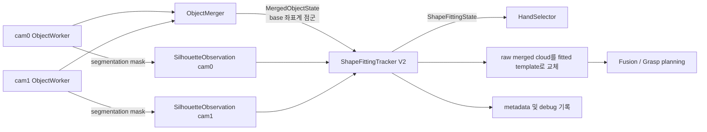
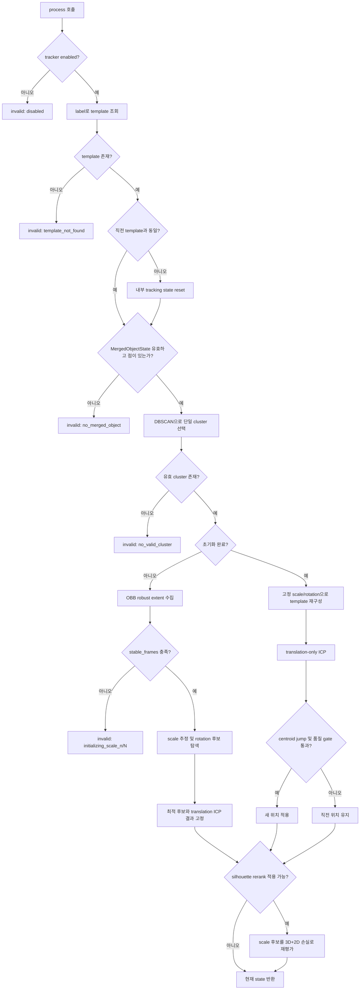

# `shape_fitting_tracker_v2.py` 동작 설명

이 문서는 실제 통합 로봇 시스템에서 사용하는 [`perception/shape_fitting_tracker_v2.py`](../perception/shape_fitting_tracker_v2.py)의 처리 과정, 초기 scale/rotation 결정, translation-only ICP, multi-view silhouette 재평가, 입출력 상태와 현재 설정을 설명한다.

이 tracker의 핵심 전략은 다음과 같다.

> 두 카메라에서 이미 robot base 좌표계로 병합된 물체 점군을 입력받아 하나의 cluster를 선택하고, label에 맞는 canonical template의 scale과 제한된 rotation을 초기화한 뒤, 이후 프레임에서는 rotation을 고정하고 translation-only ICP로 위치를 추적한다. 필요하면 cam0/cam1 segmentation silhouette로 scale만 추가 보정한다.

이 파일은 독립 실행 실험 코드인 [`shape_fitting/shape_fitting_v2.py`](../shape_fitting/shape_fitting_v2.py)와 다르다. 실제 [`robot_control_rtde_fitting_final.py`](../robot_control_rtde_fitting_final.py)는 이 문서의 `ShapeFittingTracker`를 import하여 사용한다.

## 1. 통합 시스템 안에서의 위치



통합 루프의 실제 순서는 다음과 같다.

1. cam0/cam1에서 object segmentation과 base 좌표계 점군을 만든다.
2. `ObjectMerger`가 두 점군을 `MergedObjectState`로 병합한다.
3. 각 카메라의 선택 mask와 calibration으로 `SilhouetteObservation`을 만든다.
4. `ShapeFittingTracker.process()`가 template fitting을 수행한다.
5. fitted template centroid를 기준으로 active hand를 선택한다.
6. 유효한 fitted template 점군으로 raw merged object 점군을 교체한다.
7. 교체된 형상을 fusion, grasp target 계산, 시각화와 기록에 사용한다.

## 2. 입력과 출력

### 2.1 입력: `MergedObjectState`

`process()`가 직접 사용하는 필드는 다음과 같다.

| 필드 | 용도 |
|---|---|
| `valid` | upstream 병합 결과가 유효한지 확인 |
| `label` | template library에서 정확히 일치하는 template 선택 |
| `merged_points_base` | DBSCAN, scale 초기화, ICP에 사용할 robot base 좌표계 점군 |
| `height_axis_name` | tracking ICP에서 상단 crop을 적용할 base 축 선택 |

tracker는 카메라 점군 생성이나 카메라→base 외부 파라미터 변환을 수행하지 않는다. 입력 점군은 이미 meter 단위의 robot base 좌표계라고 가정한다.

### 2.2 선택 입력: `SilhouetteObservation`

각 observation은 다음 데이터를 가진다.

| 필드 | 용도 |
|---|---|
| `camera_id` | cam0/cam1별 debug 결과 구분 |
| `mask` | 해당 카메라의 선택 object segmentation mask |
| `intrinsics` | `fx`, `fy`, `cx`, `cy` |
| `t_base_cam` | 카메라 점을 base로 변환하는 4×4 행렬 |
| `image_shape` | projection canvas 크기 |
| `weight` | multi-view 평균 가중치. 현재 호출부는 양쪽 모두 1.0 |

`robot_control_rtde_fitting_final.py`는 mask와 intrinsics가 모두 유효한 카메라만 observation 목록에 넣는다.

### 2.3 출력: `ShapeFittingState`

| 필드 | 의미 |
|---|---|
| `valid` | 현재 프레임에서 downstream이 사용할 fitting 결과가 있는지 여부 |
| `label`, `template_id` | 선택된 클래스와 template 식별자 |
| `fitted_points_base` | base 좌표계의 fitted template 점군. 출력용 downsample 적용 |
| `centroid_base` | 출력 점군의 평균 중심 |
| `scale` | `scale_xyz` 세 값의 median으로 만든 대표 scale |
| `scale_xyz` | template local OBB 축별 scale |
| `scale_mode` | `uniform` 또는 `axis_xyz` |
| `template_axes_base` | canonical x/y/z 축이 base 좌표계에서 향하는 정규화 벡터 |
| `z/roll/pitch_rotation_deg` | 초기화 때 선택되어 고정된 회전 후보 |
| `bowl_height_fraction` | wine-glass template에서 추정한 bowl 높이 비율 |
| `initialized` | scale/rotation 초기화 완료 여부 |
| `reason` | 현재 결과의 상태 또는 실패 원인 |
| `silhouette_*` | silhouette 후보 평가와 scale 변경 상세 값 |

유효한 결과는 `build_fitted_merged_object()`에서 raw merged point cloud를 대체한다. 반대로 `valid=False`이면 downstream용 object는 미검출 상태와 빈 점군으로 바뀐다.

## 3. 전체 프레임 처리 흐름



tracker가 유지하는 주요 내부 상태는 다음과 같다.

| 내부 상태 | 역할 |
|---|---|
| `_active_template` | 현재 label에 대응하는 template |
| `_tracked_cluster_centroid` | 프레임 간 동일 cluster를 연결하는 기준 |
| `_extent_buffer` | 초기 scale 계산에 사용할 target OBB extent 목록 |
| `_frozen_scale`, `_frozen_scale_xyz` | 초기화 또는 silhouette 보정 후 유지되는 scale |
| `_frozen_scale_basis`, `_frozen_scale_center` | axis scale을 적용할 canonical template OBB 기준 |
| `_frozen_rotation` | 초기 후보 탐색에서 선택된 뒤 고정되는 3×3 rotation |
| `_current_template_points` | 현재 base 좌표계 위치의 full-resolution template |
| `_last_silhouette_scale_xyz` | silhouette temporal penalty 기준 scale |
| `_initialized` | 초기 scale/rotation 결정 완료 여부 |

## 4. 현재 `handover.yaml` 설정

다음 값은 코드 기본값이 아니라 현재 [`configs/handover.yaml`](../configs/handover.yaml)의 실제 설정이다.

### 4.1 Template library

| label | asset | 단위 변환 | scale mode | 초기 rotation 후보 |
|---|---|---:|---|---|
| `cup` | `shape_fitting/template.npy` | ×0.001 | `axis_xyz` | identity만 |
| `wine glass` | `shape_fitting/wine_glass.npy` | ×0.001 | `axis_xyz` | identity만 |
| `bottle` | `shape_fitting/beer_bottle.npy` | ×0.001 | `axis_xyz` | identity만 |
| `box-shaped snack` | `shape_fitting/poteau.npy` | ×0.001 | `axis_xyz` | identity, roll ±90°, pitch ±90° |

`box-shaped snack`의 z/yaw 범위는 -90°부터 +90°까지 5° 간격으로 설정되어 있지만 `z_rotation.enabled=false`이므로 현재는 사용되지 않는다. roll과 pitch 후보는 동시에 조합하지 않으므로 현재 box 후보 수는 총 5개다.

### 4.2 Cluster, scale, ICP, 출력

| 설정 | 현재 값 | 의미 |
|---|---:|---|
| `cluster.dbscan_eps_m` | 0.02 m | DBSCAN 이웃 반경 |
| `cluster.dbscan_min_points` | 10 | core point 최소 이웃 수 |
| `cluster.max_cluster_jump_m` | 0.08 m | 이전 cluster 중심과 연결할 최대 거리 |
| `scale_init.stable_frames` | 2 | scale 초기화에 필요한 유효 extent 수 |
| `scale_init.percentile_low/high` | 5 / 95 | target OBB 양 끝 outlier 제외 범위 |
| `scale_init.min/max_scale` | 0.5 / 1.8 | 축별 scale 제한 |
| `tracking.min_cluster_extent_m` | 1e-5 m | 초기 extent 유효성 하한 |
| `icp.max_points` | 3,000 | source/target 각각의 ICP 최대 점 수 |
| `icp.max_iterations` | 10 | 최대 translation 갱신 횟수 |
| `icp.distance_threshold_m` | 0.15 m | inlier 판정 거리 |
| `icp.min_fitness` | 0.02 | 품질 판정 기준 |
| `icp.translation_tolerance_m` | 1e-5 m | 조기 종료 기준 |
| `icp.max_centroid_jump_m` | 1.1 m | 제안 위치의 최대 중심 이동 |
| `icp.crop.target_top_fraction` | 0.05 | target의 양의 높이 방향 상단 5% 제거 |
| `icp.crop.source_top_fraction` | 미설정 (`None`) | source template은 crop하지 않음 |
| `downsample.voxel_size_m` | 0.004 m | 출력 점군 voxel 크기 |
| `downsample.max_points` | 6,000 | 출력 점군 최대 점 수 |

`stable_frames: 2 # 8`처럼 주석에 이전 값이 남아 있으므로 실제 동작 값은 YAML parser가 읽는 `2`다.

### 4.3 Silhouette constraint

현재 silhouette constraint는 활성화되어 있고 `cup`, `wine glass`, `glass`, `bottle`에만 적용한다. `box-shaped snack`에는 적용하지 않는다.

다만 현재 template library에는 `glass` key가 없다. 따라서 upstream label이 실제로 `glass`이면 silhouette 단계에 도달하기 전에 `template_not_found`가 되며, 별도 `glass` template 또는 label alias를 추가해야 한다.

| 설정 | 현재 값 |
|---|---:|
| `lambda_3d` | 0 |
| `lambda_iou` | 10.75 |
| `lambda_outside` | 10.8 |
| `lambda_scale_prior` | 0 |
| `lambda_temporal` | 0 |
| `shrink_factors` | 0.90, 0.95, 0.99 |
| `uniform_growth_factors` | 1.0, 1.05 |
| `max_growth_factor` | 1.05 |
| `point_radius_px` | 2 px |
| `close_kernel_px` | 5 px |
| `dilate_px` | 1 px |
| `min_rendered_pixels` | 30 px |
| `min_segmentation_pixels` | 50 px |
| `distance_trunc_px` | 25 px |
| `robust_3d_trunc_m` | 0.03 m |
| `observed_to_template_weight` | 0.9 |
| `max_projection_points` | 1,500 |
| `robust_3d_max_points` | 2,000 |

현재 loss 가중치에서는 최종 후보 순위가 사실상 IoU loss와 mask 밖 projection loss로 결정된다. 3D loss 가중치는 0이지만, growth 후보 허용 여부를 판단할 때는 robust 3D loss가 여전히 사용된다.

## 5. Template library 로드

`ShapeFittingTracker.from_config()`는 YAML을 읽고 `perception.shape_fitting.template_library`를 로드한다. 해당 항목이 없으면 이전 호환 경로인 `perception.pose_tracking.template_library`를 사용한다.

각 template에 대해 다음 작업을 수행한다.

1. asset 경로를 현재 작업 디렉터리, repository root, config 주변에서 탐색한다.
2. `.npy`를 `float32`로 읽는다.
3. `unit_scale_m`을 곱해 meter 단위 canonical 점군을 만든다.
4. scale mode, yaw 탐색 설정, roll/pitch 후보 설정을 저장한다.
5. wine glass이면 canonical 형상에서 bowl 높이 비율을 계산한다.

template lookup은 `self._templates.get(str(label))`로 수행하므로 label 문자열이 config key와 정확히 일치해야 한다. lookup 자체는 소문자 변환이나 alias 처리를 하지 않는다.

## 6. 단일 object cluster 선택

입력 `merged_points_base`에 Open3D DBSCAN을 적용한다.

```text
eps = 0.02 m
min_points = 10
noise label = -1, 제거
```

선택 정책은 다음과 같다.

1. 기본 후보는 점이 가장 많은 cluster다.
2. 이전 프레임 중심이 있으면 중심이 가장 가까운 cluster를 찾는다.
3. 이전 중심과의 거리가 0.08 m 이하이면 가까운 cluster를 선택한다.
4. 0.08 m보다 멀면 가장 큰 cluster를 그대로 사용한다.

유효 cluster가 하나도 없으면 `no_valid_cluster`를 반환하고 `_tracked_cluster_centroid`를 제거한다. `MergedObjectState` 자체가 invalid인 `no_merged_object` 경로에서는 이전 cluster centroid를 지우지 않는다.

## 7. 초기 scale 추정

초기화되지 않은 동안 선택 cluster마다 OBB를 계산한다.

### 7.1 Target robust extent

target 점을 OBB local 좌표계로 변환한다.

```text
p_local = (p_base - obb_center) @ obb_rotation
extent_i = percentile95(p_local_i) - percentile5(p_local_i)
```

세 extent가 모두 `min_cluster_extent_m`보다 클 때만 buffer에 추가한다. 현재는 유효 extent 2개가 쌓이면 초기화한다. 이 프레임들은 연속일 필요가 없고, buffer는 유효 observation만 누적한다.

두 target extent의 축별 median을 최종 target 크기로 사용한다.

### 7.2 Template extent

canonical template도 OBB를 구하고 그 local 좌표계에서 0–100 percentile 전체 extent를 계산한다. target은 outlier에 강한 5–95 percentile인 반면 source template은 전체 범위를 사용한다.

### 7.3 Uniform scale

source와 target의 extent를 각각 크기순으로 정렬한 뒤 축별 비율의 median을 구한다.

```text
s_i = sorted_target_extent_i / sorted_source_extent_i
uniform_scale = clip(median(s_i), min_scale, max_scale)
```

### 7.4 Axis-wise scale

현재 모든 template은 `axis_xyz` 모드다. source extent와 target extent의 축을 각각 작은 순서대로 정렬하고 같은 크기 순위끼리 대응한다.

```text
scale_xyz[source_axis_by_size_rank]
    = target_extent[target_axis_by_same_rank]
      / source_extent[source_axis_by_size_rank]
```

각 scale은 0.5–1.8 범위로 제한한다. 대응 불가능한 축은 uniform scale을 fallback으로 사용한다.

`scale_xyz`의 x/y/z는 robot base의 x/y/z가 아니라 **canonical template OBB local 축**이다. scaling 과정은 다음과 같다.

```text
canonical point
→ template OBB local 좌표
→ local x/y/z별 scale 적용
→ canonical 좌표로 복원
→ 평균 중심을 원점으로 재정렬
→ 선택 rotation 적용
→ target 중심으로 이동
```

OBB의 축 방향 자체를 target OBB rotation에 맞추는 것은 아니다. target OBB는 크기 측정과 축 크기 순위 대응에만 사용된다.

## 8. 초기 rotation 후보 탐색

초기 scale을 정한 뒤 현재 target cluster 평균을 `initial_center`로 삼고 rotation 후보를 평가한다.

### 8.1 후보 구성

axis 후보는 다음 형태다.

```text
(roll, pitch) = (0, 0)
(configured roll, 0)
(0, configured pitch)
```

roll과 pitch의 비영점 후보를 동시에 적용하지 않는다. 각 axis 후보에 대해 yaw 후보를 조합한다.

```text
R_axis = R_y(pitch) @ R_x(roll)
R_candidate = R_z(yaw) @ R_axis
```

- yaw 비활성: yaw 후보는 0° 하나
- yaw 활성, exhaustive: min부터 max까지 step 간격 전체 탐색
- yaw 활성, coarse-to-fine: coarse 간격으로 먼저 탐색한 뒤 각 axis 후보의 coarse best 주변을 refine

### 8.2 후보 평가

각 rotation 후보마다 다음 과정을 독립적으로 수행한다.

1. canonical template에 고정 scale과 후보 rotation을 적용한다.
2. template 중심을 현재 target 중심에 둔다.
3. translation-only ICP로 위치를 미세 보정한다.
4. 다음 tuple을 큰 순서로 비교한다.

```text
score = (fitness, -RMSE, -translation_distance)
```

Python tuple의 사전식 비교를 사용하므로 우선순위는 다음과 같다.

1. fitness가 높은 후보
2. fitness가 같으면 RMSE가 낮은 후보
3. 둘 다 같으면 추가 translation이 작은 후보

최적 후보의 scale, rotation, translation 적용 결과를 `_frozen_*` 상태와 `_current_template_points`에 저장한다. 이후 일반 tracking 단계에서는 이 rotation을 다시 탐색하거나 갱신하지 않는다.

### 8.3 현재 카테고리별 동작

- cup, wine glass, bottle: identity rotation만 평가
- box-shaped snack: identity, roll +90°, roll -90°, pitch +90°, pitch -90°의 5개 후보 평가
- box yaw: 현재 비활성

따라서 현재 시스템은 box가 어느 축을 세로로 두는지는 초기화 때 선택할 수 있지만, 평면 안에서의 연속적인 yaw는 추정하지 않는다.

## 9. Translation-only ICP

초기 후보 평가와 이후 위치 tracking 모두 같은 자체 ICP를 사용한다.

### 9.1 입력 crop

`MergedObjectState.height_axis_name`을 x/y/z index로 변환해 tracking crop 축으로 사용한다. 이름을 해석할 수 없으면 config의 `height_axis_index`로 fallback한다.

현재 target은 해당 축의 최댓값 쪽 5%를 제거하고 source template은 crop하지 않는다.

```text
threshold = axis_min + (1 - remove_fraction) × (axis_max - axis_min)
keep = axis_value <= threshold
```

다음 경우 crop을 취소하고 원본을 사용한다.

- 높이 extent가 0.01 m보다 작음
- crop 결과가 80점보다 적음
- fraction 또는 axis index가 유효하지 않음

초기 rotation 후보 평가에서는 `MergedObjectState.height_axis_name`이 아니라 config의 `icp.crop.height_axis_index`를 직접 사용한다. 현재 두 값 모두 z이므로 결과는 같다.

### 9.2 Subsampling과 최근접 점 검색

source와 target을 각각 최대 3,000점으로 등간격 index sampling한다. SciPy가 설치되어 있으면 `cKDTree`로 batch nearest-neighbor query를 수행하고, 없으면 Open3D KDTree로 한 점씩 조회한다.

### 9.3 초기 translation과 반복

회전과 scale은 ICP 입력 전에 이미 적용되어 있다. ICP transform은 중심 차이로 시작한다.

```text
t0 = mean(target) - mean(source)
```

매 반복에서 각 변환 source 점의 최근접 target을 구한다.

```text
q_i = nearest_target(p_i + t)
delta_t = mean(q_i - (p_i + t))
t ← t + delta_t
```

다음 중 하나면 종료한다.

- 최대 10회 반복
- `||delta_t|| <= 1e-5 m`

반환 transform의 rotation 블록은 항상 identity다.

### 9.4 Fitness와 RMSE

현재 0.15 m 이내의 대응점을 inlier로 본다.

```text
fitness = inlier_count / source_count
RMSE = sqrt(mean(inlier_nearest_distance²))
```

inlier가 없으면 모든 최근접 거리로 RMSE를 계산한다. 구현상 각 반복의 최근접 거리를 계산한 뒤 translation을 갱신하고, 갱신 전 거리로 fitness와 RMSE를 기록한다. 그러므로 반환 metric은 최종 갱신 위치를 한 번 더 평가한 값과 약간 다를 수 있다.

## 10. 초기화 이후 tracking

초기화된 프레임마다 다음을 수행한다.

1. `_current_template_points`의 직전 중심을 계산한다.
2. full canonical template에서 다시 시작한다.
3. frozen scale과 frozen rotation을 적용한다.
4. 재구성한 template을 직전 중심에 둔다.
5. 현재 cluster를 target으로 translation-only ICP를 수행한다.
6. 제안 template과 직전 template의 중심 이동량을 계산한다.
7. accept 조건을 만족하면 새 위치를 저장하고, 아니면 직전 위치를 유지한다.

매 프레임 canonical template에서 다시 생성하므로 voxel downsample이나 수치 오차가 원본 형상에 누적되지 않는다.

### 10.1 ICP accept/hold 조건

코드의 현재 조건은 다음과 같다.

```text
quality_ok = fitness >= min_fitness
             OR RMSE <= 2.5 × distance_threshold

accept = centroid_jump <= max_centroid_jump
         AND (quality_ok OR icp_translation_m > 0)
```

현재 수치로 바꾸면 다음과 같다.

```text
quality_ok = fitness >= 0.02 OR RMSE <= 0.375 m
centroid_jump <= 1.1 m
```

주의할 점은 `icp_translation_m > 0`이면 `quality_ok`가 거짓이어도 통과한다는 것이다. ICP는 중심 정렬 translation까지 포함하므로 보통 translation이 정확히 0보다 크다. 따라서 현재 설정과 조건에서는 실질적으로 1.1 m centroid-jump 제한이 가장 강한 gate가 된다.

거부되면 다음과 같이 동작한다.

- `_current_template_points`를 갱신하지 않음
- 이전 template 점군과 중심을 유효한 state로 반환
- `tracking_mode="hold"`
- reason은 `hold_fitness_..._jump_...`

반면 upstream object 자체가 invalid이거나 DBSCAN cluster가 없으면 이전 점군을 반환하지 않고 `valid=False`, 빈 fitted 점군을 반환한다.

## 11. Multi-view silhouette scale 재평가

silhouette constraint는 ICP가 정한 위치와 rotation을 유지하면서 scale 후보만 다시 평가하는 후처리다. 초기화가 끝난 프레임과 이후 tracking 프레임 모두에서 호출된다.

### 11.1 적용 조건

다음 조건을 모두 만족해야 한다.

- silhouette 기능이 활성화됨
- template label이 적용 목록에 있거나 `apply_to_all=true`
- `freeze_silhouette_scale=false`
- fitting state가 valid이고 tracker가 초기화됨
- 최소 하나의 mask observation이 있음
- frozen scale과 current template 점군이 있음
- 현재 3D cluster가 비어 있지 않음

통합 호출부는 `home_object_locked`를 `freeze_silhouette_scale`로 전달한다. home object가 lock된 뒤에는 reason `scale_frozen_home_locked`로 scale 변경을 중단한다.

### 11.2 Scale 후보 생성

현재 모든 template은 `axis_xyz` 모드이므로 기본적으로 다음 후보를 만든다.

- 현재 scale
- 전체 축 ×0.90, ×0.95, ×0.99
- x축만 ×0.90, ×0.95, ×0.99
- y축만 ×0.90, ×0.95, ×0.99
- z축만 ×0.90, ×0.95, ×0.99
- 전체 축 ×1.05

scale 범위와 중복 제거 때문에 실제 개수는 달라질 수 있지만, 경계에 걸리지 않으면 14개다. growth는 현재 scale의 최대 1.05배와 전역 `max_scale` 중 더 작은 값까지만 허용된다.

uniform 모드라면 현재 scale, 세 shrink 후보, 전체 ×1.05로 중복 제거 후 보통 5개다.

각 후보는 current template 중심, frozen rotation과 같은 scale basis를 유지한다. 후보별 ICP를 다시 수행하지는 않는다.

### 11.3 3D robust loss

후보 template→관측 점군과 관측 점군→후보 template의 양방향 최근접 거리를 계산한다. 각 거리를 0.03 m에서 clipping하고 정규화한다.

```text
L_template = mean(min(d(template, observed), trunc)) / trunc
L_observed = mean(min(d(observed, template), trunc)) / trunc
L_3D = L_template + observed_to_template_weight × L_observed
```

현재 `observed_to_template_weight=0.9`다. 최종 합산 가중치는 0이지만 growth 후보 gate에는 이 값이 사용된다.

### 11.4 2D projection과 mask loss

각 camera observation에 대해 다음을 수행한다.

1. `t_base_cam`의 역행렬로 후보 점군을 base→camera 변환한다.
2. positive z이고 영상 안에 들어오는 점을 pinhole model로 투영한다.
3. 최대 1,500개 projected point를 반경 2 px 원으로 rasterize한다.
4. 5×5 closing과 반경 1 px dilation을 적용한다.
5. segmentation mask와 IoU를 계산한다.
6. template projection 중 segmentation mask 밖으로 나간 pixel의 distance-transform penalty를 계산한다.

영상별 최소 segmentation pixel은 50이다. rendered pixel이 30보다 작으면 해당 카메라의 IoU는 0, outside loss는 1로 처리한다. 유효 observation은 weight로 평균하며 현재 cam0/cam1의 weight는 동일하다.

```text
L_IoU = 1 - weighted_mean(IoU)
L_outside = weighted_mean(outside_distance_loss)
```

outside loss는 단순한 mask 밖 pixel 비율이 아니라, mask 밖으로 나간 정도를 25 px에서 truncate한 거리와 밖으로 나간 pixel 비율을 함께 반영한다.

### 11.5 Prior와 temporal loss

코드에는 다음 penalty도 있다.

- scale prior: 현재 scale보다 커지는 것을 줄어드는 것보다 강하게 벌점
- temporal scale: 직전 silhouette 선택 scale과 급격히 달라지는 것을 억제
- min/max scale boundary penalty

현재 YAML에서는 두 항의 합산 가중치가 모두 0이므로 최종 순위에는 반영되지 않는다.

### 11.6 최종 loss와 growth 제한

일반식은 다음과 같다.

```text
L_total = λ3D × L3D
        + λIoU × LIoU
        + λoutside × Loutside
        + λprior × Lprior
        + λtemporal × Ltemporal
```

현재는 다음 두 항만 직접 합산된다.

```text
L_total = 10.75 × (1 - mean_IoU)
        + 10.8 × outside_loss
```

shrink 후보는 유효한 silhouette score가 있으면 그대로 경쟁한다. growth 후보는 추가로 다음을 만족해야 한다.

```text
candidate IoU > baseline IoU + 1e-4
candidate robust_3D_loss <= baseline robust_3D_loss + 0.05
```

허용 후보 중 total loss가 가장 작은 scale을 선택한다. scale이 바뀌면 frozen scale과 full current template 점군을 즉시 교체하며, 새 값이 다음 프레임 기준이 된다. rotation과 중심 위치는 바꾸지 않는다.

## 12. Wine-glass bowl 높이 추정

wine-glass template을 로드할 때 canonical z 방향의 폭 profile로 bowl 영역의 높이 비율을 한 번 계산한다.

1. canonical z 범위를 40개 bin으로 나눈다.
2. 각 bin의 XY 점 중 최대 지름을 계산한다. 점이 많으면 최대 128개로 제한한다.
3. 빈 bin은 interpolation하고 5-bin moving average로 부드럽게 한다.
4. 상단 15% bin의 median 폭을 기준 폭으로 삼는다.
5. 기준 폭의 60% 이상인 bin이 2개 연속 시작하는 위치를 bowl 시작점으로 본다.
6. `bowl_start_z`부터 template top까지의 비율을 반환한다.

이 값은 `ShapeFittingState.bowl_height_fraction`으로 노출된다. fitting 자체의 ICP나 scale 계산에는 사용되지 않는다.

## 13. 출력 downsample과 template 축

### 13.1 출력 점군

내부 `_current_template_points`는 full canonical point 수를 유지한다. 외부 state를 만들 때만 다음을 적용한다.

1. 4 mm voxel마다 점 평균
2. 6,000점을 넘으면 배열 전체에서 등간격 index sampling
3. `float32` base 좌표계 점군으로 반환

따라서 downstream 연산량은 줄이면서 다음 프레임 fitting은 원본 template 해상도를 유지한다.

### 13.2 `template_axes_base`

초기화된 유효 state에서는 canonical x/y/z 단위축에 다음 변환을 적용한다.

```text
canonical axis
→ template OBB scale basis
→ axis scale
→ canonical frame 복원
→ frozen rotation
→ normalization
```

이 세 축은 downstream의 local-axis 폭 추정과 grasp geometry 계산에 사용할 수 있다. translation은 방향 벡터에 영향을 주지 않으므로 포함하지 않는다.

## 14. State와 debug 상태값

### 14.1 주요 `reason`

| reason | 의미 | state valid |
|---|---|---:|
| `disabled` | shape fitting 비활성 | false |
| `template_not_found` | label과 일치하는 template 없음 | false |
| `no_merged_object` | upstream object invalid 또는 점군 없음 | false |
| `no_valid_cluster` | DBSCAN 유효 cluster 없음 | false |
| `initializing_scale_n/N` | scale extent 수집 중 | false |
| `ok` | 유효 template 초기화 또는 tracking | true |
| `empty_fitted_template` | fitting 뒤 출력 점군 없음 | false |
| `hold_fitness_*_jump_*` | ICP 제안 거부, 직전 위치 유지 | 보통 true |

### 14.2 `tracking_mode`

| mode | 의미 |
|---|---|
| `uninitialized` | 아직 처리 전 또는 template 없음 |
| `init_pending` | extent buffer 수집 중 |
| `init` | scale/rotation 초기화 프레임 |
| `translation_icp` | 새 ICP translation 적용 |
| `hold` | 유효 입력이 없거나 ICP 제안 거부 |

### 14.3 `ShapeFittingDebug`

`last_debug`는 다음 종류의 값을 제공한다.

- raw/cluster/output point 수
- scale buffer 진행도
- frozen scale, scale mode
- ICP 시간, 환산 FPS, fitness, RMSE, translation, source/target 점 수, 반복 수
- 선택 yaw/roll/pitch와 rotation 후보 수
- silhouette 후보 수, camera별 IoU, 각 loss, scale 변경 전후 값

초기화 함수가 rotation 후보와 ICP 상세 debug를 한 번 기록한 직후, `process()`가 일반 `init` debug를 다시 기록한다. 이 두 번째 호출에는 초기 rotation 후보 수와 ICP metric을 전달하지 않으므로 최종 `last_debug`에서는 초기 후보 상세 값이 기본값으로 덮일 수 있다. frozen roll/pitch/yaw 값 자체는 활성화된 rotation 종류에 대해 복원된다.

## 15. Reset 동작

다음 상황에서 내부 fitting 상태가 reset된다.

- 현재 `template_id`와 다른 label/template이 들어옴
- 로봇 시스템 reset 경로가 `shape_fitting_tracker.reset()`을 호출함

reset되는 항목은 cluster 중심, extent buffer, frozen scale/rotation, current template 점군, silhouette temporal state와 `_initialized`다. `_active_template`, `last_state`, `last_debug` 객체는 `reset()`에서 직접 초기화하지 않으며 다음 `process()` 호출 때 새 값으로 갱신된다.

검출이 한 프레임 끊겨 `no_merged_object`가 되는 것만으로 전체 scale/rotation 초기화를 다시 하지는 않는다.

## 16. 함수별 역할

| 함수/클래스 | 역할 |
|---|---|
| `ShapeTemplateModel` | template asset과 scale/rotation 설정 보관 |
| `ShapeFittingState` | downstream에 전달하는 표준 fitting 결과 |
| `ShapeFittingDebug` | 실시간 성능과 품질 진단값 |
| `_resolve_path()` | config와 asset 상대 경로 탐색 |
| `_build_oriented_bbox()` | OBB 생성, 실패 시 axis-aligned fallback |
| `_compute_oriented_robust_extent()` | OBB local percentile 크기 계산 |
| `_estimate_uniform_scale()` | 정렬 extent 비율의 median scale |
| `_estimate_axis_scale()` | 크기 순위로 대응한 local 축별 scale |
| `_apply_similarity_pose()` | local scale, rotation, target 중심 배치 |
| `_filter_points_by_local_height()` | 양의 높이 방향 상단 점 제거 |
| `_query_nearest_neighbors_batched()` | SciPy/Open3D 최근접점 조회 |
| `_estimate_template_bowl_height_fraction()` | wine-glass bowl 높이 비율 추정 |
| `ShapeFittingTracker.process()` | 한 프레임의 전체 fitting 상태 전이 |
| `_filter_single_cluster()` | DBSCAN과 이전 중심 기반 단일 cluster 선택 |
| `_initialize_template()` | scale과 초기 rotation 후보 평가 및 고정 |
| `_run_translation_only_icp()` | 위치만 갱신하는 자체 ICP |
| `_maybe_rerank_with_silhouette()` | 3D+multi-view 2D 기반 scale 후보 재평가 |
| `_downsample_output()` | 외부 전달용 fitted 점군 축소 |
| `_template_axes_base()` | canonical local 축의 base 방향 계산 |
| `_load_template_library()` | YAML template library와 `.npy` 로드 |
| `_make_state()`, `_set_debug()` | 출력 타입 정규화 및 최신 상태 저장 |

## 17. 현재 구현에서 특히 주의할 점

1. **일반 tracking은 translation-only다.** 초기화 뒤 물체가 회전해도 template rotation은 따라가지 않는다.
2. **box도 연속 자세 추적은 하지 않는다.** 초기 5개 축 후보 중 하나를 고른 뒤 고정한다.
3. **target OBB rotation을 pose로 직접 사용하지 않는다.** OBB는 extent와 scale basis 계산에 사용한다.
4. **silhouette가 켜지면 scale은 완전히 고정되지 않는다.** 초기 frozen scale을 매 유효 프레임 shrink/growth 후보로 다시 평가할 수 있다.
5. **현재 box에는 silhouette가 적용되지 않는다.** `apply_to_all=false`이고 적용 label 목록에 box가 없다.
6. **label은 exact match다.** 대소문자나 별칭이 다르면 `template_not_found`가 된다.
7. **현재 ICP 품질 gate는 매우 관대하다.** 1.1 m jump와 `translation_m > 0` 조건 때문에 낮은 품질도 받아들일 수 있다.
8. **ICP fitness/RMSE는 마지막 translation 갱신 전 correspondence 거리다.** 최종 pose 재평가 metric과 약간 다를 수 있다.
9. **`hold`의 의미가 두 가지다.** ICP 제안 거부 시에는 이전 template을 valid로 반환하지만, object/cluster 부재 시에는 invalid와 빈 점군을 반환한다.
10. **silhouette projection에는 z-buffer나 실제 depth occlusion 검사가 없다.** 영상 안의 positive-depth template 점을 모두 rasterize한다.
11. **silhouette camera별 예외는 조용히 무시된다.** calibration, mask 또는 projection 오류가 있으면 해당 camera가 score에서 빠진다.
12. **template asset 좌표 방향이 중요하다.** unit conversion만 하며 독립 스크립트의 `DISPLAY_TRANSFORM` 같은 y/z 반전은 적용하지 않는다.
13. **axis scale은 물리 축 이름이 아니라 extent 크기 순위로 대응한다.** 비슷한 크기의 축은 OBB 흔들림에 따라 대응이 달라질 수 있다.
14. **wine-glass bowl 비율은 canonical z를 높이로 가정한다.** asset 축이 다르면 의미가 달라진다.

## 18. 튜닝 가이드

| 현상 | 우선 확인할 설정/상태 | 방향 |
|---|---|---|
| 배경 cluster로 전환됨 | `dbscan_eps_m`, `max_cluster_jump_m`, upstream mask | eps/jump를 줄이면 보수적 추적 |
| 물체 점군이 여러 cluster로 갈라짐 | `dbscan_eps_m`, `dbscan_min_points` | eps 증가 또는 min points 감소 |
| 초기 크기가 불안정함 | `stable_frames`, percentile 범위 | frame 수 증가, percentile 범위 축소 |
| 축별 scale이 뒤바뀜 | template/target OBB extent, asset 축 | `uniform` 검토 또는 명시적 축 대응 필요 |
| box가 옆으로 눕거나 축 방향이 틀림 | `axis_rotation_candidates`, 후보별 fitness/RMSE | 필요한 90° 후보 추가 또는 제거 |
| box yaw가 맞지 않음 | `z_rotation.enabled` | yaw 탐색 활성화와 범위/step 조절 |
| 초기 rotation 탐색이 느림 | yaw step, coarse-to-fine, axis 후보 수, ICP 점 수 | coarse-to-fine 또는 후보/점 수 축소 |
| tracking 위치가 튐 | `max_centroid_jump_m`, ICP threshold, accept 조건 | jump 축소, 품질 gate 강화 |
| 손/가림에 중심이 끌림 | target crop fraction, height axis | crop 비율과 height axis 확인 |
| 투명 물체 template이 너무 큼 | silhouette shrink 후보, IoU/outside 가중치 | shrink 후보와 outside penalty 조정 |
| silhouette scale이 계속 줄어듦 | shrink factor, prior/temporal lambda | shrink 완화, prior/temporal 가중치 활성화 |
| silhouette가 동작하지 않음 | `silhouette_reason`, label 목록, mask pixel 수 | debug reason과 observation 유효성 확인 |
| 연산 시간이 큼 | ICP max points, rotation 후보, projection points | point/candidate 수 감소 |

## 19. 핵심 요약

현재 통합 시스템의 `ShapeFittingTracker V2`는 다음 특성을 갖는다.

- base 좌표계 merged point cloud와 label을 입력으로 받는다.
- DBSCAN과 이전 중심으로 추적할 단일 cluster를 고른다.
- 현재 2개 유효 프레임의 OBB 크기로 local 축별 scale을 초기화한다.
- 대부분의 물체는 identity 자세, box는 5개의 축 자세 후보 중 ICP 점수가 가장 좋은 자세를 선택한다.
- 초기화 이후 rotation은 고정하고 translation-only ICP로 위치만 추적한다.
- cup/wine glass/bottle은 cam0/cam1 silhouette로 scale을 프레임마다 재평가할 수 있다.
- 최종 fitted template 점군과 중심, scale, local 축, 품질 지표를 downstream hand selection과 grasp pipeline에 전달한다.

즉 이 구현은 완전한 6-DoF registration보다는 **초기 제한 회전 선택 + 형상 scale 추정 + 안정적인 위치 추적 + 투명 물체 scale 보정**에 초점을 둔다.