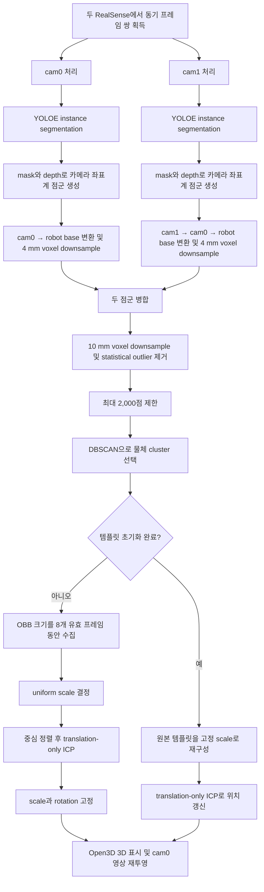

# `shape_fitting_v2.py` 동작 설명

이 문서는 [`shape_fitting_v2.py`](./shape_fitting_v2.py)가 두 대의 RealSense 카메라 영상에서 컵 또는 와인잔을 분할하고, 두 카메라의 3D 점군을 합친 뒤, `template.npy` 형상을 물체의 크기와 위치에 맞추어 실시간 추적하는 과정을 설명한다.

현재 구현에서 **초기 8개 유효 프레임은 템플릿의 크기를 결정**하고, 초기화 이후에는 **템플릿의 크기와 회전을 고정한 채 translation-only ICP로 위치만 갱신**한다. 따라서 이 코드는 완전한 6-DoF pose estimation이 아니라, 물체의 위치 추적에 초점을 둔 shape fitting 구현이다.

## 1. 전체 처리 흐름



프레임 단위로 보면 다음 네 단계로 요약할 수 있다.

1. 각 카메라에서 대상 instance의 RGB-D 점군을 만든다.
2. 두 점군을 robot base 좌표계에서 병합하고, 하나의 물체 cluster를 고른다.
3. 최초 8개 유효 프레임에서 템플릿 크기를 결정한다.
4. 그 이후에는 매 프레임 translation-only ICP로 템플릿 위치만 추적한다.

## 2. 주요 입력, 출력, 의존 파일

### 입력

| 입력 | 역할 |
|---|---|
| RealSense cam0, cam1 | 정렬된 BGR 영상, meter 단위 depth, 카메라 내부 파라미터 제공 |
| `configs/handover.yaml` | 카메라 serial, 스트림 설정, depth filter 설정, 동기 허용 시간, 외부 파라미터 파일 위치 제공 |
| `yoloe-26l-seg.pt` | `wine glass`, `cup` instance segmentation |
| `shape_fitting/template.npy` | fitting할 원본 템플릿 점군. 파일 값은 mm로 간주한다. |
| `camera_parameters/c0_to_robot.pckl` | cam0에서 robot base로 가는 외부 파라미터 |
| `camera_parameters/rot_trans_c1.dat` | cam1에서 cam0로 가는 외부 파라미터 |

### 출력

이 스크립트는 pose 파일이나 ROS 메시지를 출력하지 않는다. 실행 중 다음 결과만 표시한다.

- Open3D 창: 선택된 실제 물체 점군은 회색, fitted template은 검은색으로 표시
- OpenCV 창: cam0/cam1 segmentation 결과, 상태 정보, cam0에 재투영한 fitted template 표시
- 터미널: DBSCAN 선택 결과와 ICP 시간, 점 개수, 반복 수, 이동량, fitness, RMSE 출력

## 3. 주요 파라미터

스크립트가 실제로 사용하는 주요 하드코딩 파라미터는 다음과 같다.

| 그룹 | 파라미터 | 값 | 의미 |
|---|---|---:|---|
| 카메라 | `WIDTH`, `HEIGHT`, `FPS` | 640, 480, 30 | 두 카메라에 공통으로 적용할 스트림 설정 |
| segmentation | `TARGET_CLASSES` | `wine glass`, `cup` | YOLOE prompt 및 선택 대상 클래스 |
| depth | `DEPTH_MIN_M`, `DEPTH_MAX_M` | 0.30, 1.50 m | 3D 점으로 사용할 depth 범위 |
| depth | `BILATERAL_RADIUS` | 2 | bilateral kernel 반경. 실제 kernel은 5×5 |
| sampling | `POINT_STRIDE` | 2 | mask를 가로·세로 2 pixel 간격으로 샘플링 |
| sampling | `POINT_MAX_POINTS` | 12,000 | 카메라별 역투영 직후 최대 점 개수 |
| downsample | `PER_CAMERA_VOXEL_SIZE_M` | 0.004 m | 카메라별 voxel 크기 |
| merge | `MERGE_VOXEL_SIZE_M` | 0.010 m | 병합 뒤 voxel 크기 |
| ICP/cluster | `ICP_MAX_POINTS` | 2,000 | 병합 점군과 ICP 입력의 최대 점 개수 |
| DBSCAN | `DBSCAN_EPS_M` | 0.02 m | 이웃으로 간주하는 거리 |
| DBSCAN | `DBSCAN_MIN_POINTS` | 10 | core point가 되기 위한 최소 이웃 수 |
| tracking | `TRACKING_CLUSTER_MAX_JUMP_M` | 0.08 m | 이전 cluster 중심과 연결할 최대 거리 |
| scale init | `SCALE_INIT_VALID_FRAMES` | 8 | 크기 초기화에 필요한 유효 프레임 수 |
| extent | `ROBUST_EXTENT_*` | 5%, 95% | target OBB 크기 계산 시 양 끝 outlier 제외 |
| scale | `MIN/MAX_TEMPLATE_SCALE` | 0.5, 1.8 | uniform scale 제한 |
| ICP | `ICP_DISTANCE_THRESHOLD_M` | 0.09 m | fitness/RMSE 계산용 inlier 거리 기준 |
| ICP | `ICP_MAX_ITERATIONS` | 12 | 프레임당 최대 translation 갱신 횟수 |
| ICP crop | `ICP_CROP_TARGET_TOP_FRACTION` | 0.10 | target의 display z 최댓값 쪽 10% 제거 |
| ICP stop | `ICP_TRANSLATION_TOLERANCE_M` | 1e-5 m | translation 변화가 0.01 mm 이하이면 조기 종료 |

`configs/handover.yaml`에도 segmentation과 point-cloud 관련 설정이 있지만, 이 스크립트는 그 값을 읽지 않고 위 상수를 직접 사용한다. config에서 실제로 읽는 것은 주로 카메라 설정, depth filter 설정, 동기 설정 및 calibration chain이다.

## 4. 좌표계와 단위

### 4.1 점군 단위

- RealSense depth와 실시간 점군: meter
- `template.npy`: 로드 직후 `0.001`을 곱하므로 원본 단위는 mm로 가정
- 화면과 로그의 translation: 내부 계산은 meter, 표시는 mm 또는 mm/s

템플릿 원본이 이미 meter 단위라면 현재 코드는 실제보다 1,000배 작게 읽으므로 주의해야 한다.

### 4.2 카메라에서 robot base로 변환

외부 파라미터 chain은 다음과 같이 구성된다.

```text
T_base_cam0 = c0_to_robot.pckl
T_cam0_cam1 = rot_trans_c1.dat
T_base_cam1 = T_base_cam0 @ T_cam0_cam1
```

점 `p`는 코드의 row-vector 표현상 다음과 같이 변환된다.

```text
p_base = p_camera @ R^T + t
```

두 카메라의 점군은 모두 robot base 좌표계로 옮긴 뒤에만 병합한다. 따라서 calibration 오차는 병합 점군의 이중 윤곽, 부정확한 OBB 크기, ICP 오차로 직접 이어진다.

### 4.3 Open3D display 좌표계

시각화와 fitting에는 다음 변환을 적용한다.

```text
DISPLAY_TRANSFORM = diag(1, -1, -1, 1)
```

즉 x는 유지하고 y와 z의 부호를 뒤집는다. 이 행렬은 자기 자신의 역행렬이다. 처리 흐름은 다음과 같다.

```text
camera → robot base → display(Open3D/ICP)
display fitted template → robot base → cam0 → image projection
```

ICP crop의 `height_axis_index=2`도 **robot base z가 아니라 부호가 뒤집힌 display z**에 적용된다. 따라서 `top`이라는 이름보다 정확한 동작은 “display z의 최댓값 쪽 10% 제거”이다.

## 5. 초기화 단계

`main()`이 시작되면 다음 순서로 초기화한다.

1. `DualSensorHub.from_config()`로 두 카메라 설정을 읽는다.
2. 스크립트 상수인 640×480, 30 FPS를 hub에 다시 지정하고 카메라를 시작한다.
3. `SegmentationEngine`을 생성하고 YOLOE에 `wine glass`, `cup` prompt를 설정한다.
4. cam0→base, cam1→cam0 변환을 읽어 `TransformChain`을 만든다.
5. Open3D visualizer와 좌표축을 만든다.
6. `template.npy`를 mm에서 meter로 변환하고 display 좌표계로 뒤집는다.
7. 추적 상태, scale buffer, ICP 통계를 초기화한다.

주요 상태 변수는 다음과 같다.

| 변수 | 의미 |
|---|---|
| `template_initialized` | 8개 유효 extent를 모아 템플릿 초기화를 끝냈는지 여부 |
| `tracked_cluster_centroid` | 이전 프레임에서 선택한 cluster 중심. DBSCAN cluster 연결에 사용 |
| `scale_obb_extent_buffer` | 초기 크기 결정을 위한 target OBB extent 목록 |
| `frozen_template_scale` | 초기화 후 고정되는 uniform scale |
| `frozen_template_rotation` | 고정 회전. 현재 구현에서는 항상 identity |
| `last_icp_*` | 화면과 터미널에 표시할 최근 ICP 통계 |

## 6. 카메라별 프레임 처리

각 프레임 쌍에서 `process_camera_frame()`을 cam0과 cam1에 각각 호출한다.

### 6.1 depth filtering

`frame_bundle.depth_image_m`을 가져온 뒤 `BILATERAL_ENABLED=True`이면 OpenCV bilateral filter를 적용한다.

- 유효 depth: finite이고 0.001 m 이상, `zfar` 미만
- kernel 크기: `2 × radius + 1 = 5`
- 공간 sigma: 2.0
- depth sigma: 함수 기본값인 0.02 m
- invalid pixel은 filter 전후에 0으로 유지
- 예외가 발생하면 raw depth로 fallback

현재 config에서도 카메라별 bilateral filter가 활성화되어 있다. `RealSenseCamera.read()`가 config 기반 bilateral을 먼저 적용하고, `process_camera_frame()`이 다시 bilateral을 적용하므로 **현재 설정에서는 bilateral filter가 두 번 적용**된다.

### 6.2 instance segmentation과 대상 선택

YOLOE 설정은 다음과 같다.

```text
imgsz=640, conf=0.25, iou=0.45, max_det=100
retina_masks=True, half=False
```

검출된 instance 중 클래스가 `wine glass` 또는 `cup`인 것만 남기고, `highest_score` 정책으로 confidence가 가장 높은 instance 하나만 고른다. 두 클래스가 동시에 검출되어도 config의 `prefer_wine_glass_over_cup`은 이 코드에서 전달하지 않으므로 사용되지 않는다. 선택된 instance mask는 합쳐지지만 현재는 최대 한 개이므로 사실상 그 instance의 mask와 같다.

### 6.3 mask와 depth의 3D 역투영

mask와 depth를 2 pixel 간격으로 샘플링하고 다음 조건을 모두 만족하는 pixel만 사용한다.

```text
mask == True
depth가 finite
0.30 m <= depth <= 1.50 m
```

pixel `(u, v)`와 depth `z`는 카메라 내부 파라미터를 이용해 다음과 같이 3D로 변환된다.

```text
x = (u - cx) / fx × z
y = (v - cy) / fy × z
z = depth
```

점이 12,000개보다 많으면 무작위로 12,000개를 비복원 추출한다. 색상은 BGR에서 RGB로 변환해 각 점과 함께 유지한다.

### 6.4 base 변환과 카메라별 downsample

생성된 점군을 해당 카메라 좌표계에서 robot base 좌표계로 변환한 뒤, 4 mm voxel마다 점과 색상의 평균을 계산한다. 선택 instance가 존재하고 base 점군이 한 점 이상이면 해당 카메라 프레임을 `valid`로 판단한다.

## 7. 두 카메라 점군 병합과 cluster 추적

### 7.1 병합, voxel downsample, outlier 제거

유효 카메라의 점군만 사용한다. 한 카메라만 유효해도 이후 처리는 계속된다.

1. 유효 점군을 단순 concatenate한다.
2. 10 mm voxel마다 좌표와 색상을 평균낸다.
3. statistical outlier removal을 적용한다.
   - 각 점의 최근접 이웃 최대 20개까지 사용
   - 각 점의 평균 이웃 거리를 계산
   - 전체 평균 + `2.0 × 표준편차`보다 먼 점 제거
4. 남은 점이 2,000개보다 많으면 배열 전체에서 등간격 index로 2,000개를 고른다.

`merge_point_clouds()`에 radius 관련 인자도 전달하지만 `outlier_method="statistical"`이므로 현재 실행에서는 사용되지 않는다.

### 7.2 DBSCAN

병합 점군에 Open3D DBSCAN을 적용한다.

```text
eps = 0.02 m
min_points = 10
```

noise label `-1`은 버린다. 유효 cluster 선택 정책은 추적 이력의 유무에 따라 달라진다.

- 이전 중심이 없으면 점이 가장 많은 cluster 선택
- 이전 중심이 있으면 가장 가까운 cluster를 찾음
- 그 거리가 0.08 m 이하면 가장 가까운 cluster 선택
- 0.08 m보다 크면 점이 가장 많은 cluster로 fallback

선택된 cluster의 중심은 다음 프레임의 연결 기준으로 저장된다. DBSCAN에서 유효 cluster가 없거나 카메라 점군이 전혀 없으면 중심 이력을 `None`으로 초기화한다.

## 8. 템플릿 크기 초기화

초기화 전 상태는 `init_pending`이다. 유효 cluster를 얻을 때마다 다음 작업을 수행한다.

### 8.1 target robust extent 수집

1. cluster를 display 좌표계로 변환한다.
2. Open3D oriented bounding box(OBB)를 계산한다.
3. 점을 OBB local 좌표계로 옮긴다.
4. 각 축에서 5 percentile과 95 percentile의 차를 robust extent로 사용한다.
5. 세 축 모두 `1e-5 m`보다 클 때만 buffer에 추가한다.

따라서 segmentation 경계나 depth spike처럼 극단에 있는 약 10%의 값이 target 크기에 미치는 영향을 줄인다. 유효 extent가 누적 8개가 될 때까지 템플릿은 화면에 추가되지 않는다. 이 buffer는 연속 프레임만 요구하지 않으며 초기화 도중 검출이 끊겨도 기존 값은 유지된다.

### 8.2 uniform scale 계산

8개 target extent의 축별 median을 구한다. 원본 템플릿 크기는 템플릿 OBB local 좌표계에서 0–100 percentile, 즉 전체 범위로 계산한다.

그 다음 source와 target의 세 extent를 각각 오름차순으로 정렬하고, 유효 축의 크기 비율을 계산한다.

```text
axis_scale_i = sorted_target_extent_i / sorted_template_extent_i
uniform_scale = median(axis_scale_i)
uniform_scale = clip(uniform_scale, 0.5, 1.8)
```

축을 정렬하므로 OBB 축의 순서가 서로 다른 문제를 어느 정도 피한다. 세 축을 독립적으로 늘리는 anisotropic scaling이 아니라 하나의 값으로 모든 축을 동일하게 확대·축소한다.

### 8.3 초기 pose

원본 템플릿을 자기 중심 기준으로 uniform scaling하고, 현재 target cluster 중심으로 이동한다.

```text
p_initialized = (p_template - template_centroid) × scale + target_centroid
```

회전에는 identity 행렬을 사용한다. target OBB의 회전을 템플릿에 적용하지 않으므로 `frozen_template_rotation`도 identity로 고정된다. 마지막으로 translation-only ICP를 한 번 수행해 초기 중심 위치를 보정하고 `template_initialized=True`로 전환한다.

## 9. Translation-only ICP

`run_translation_only_icp()`는 Open3D의 일반 point-to-point ICP 대신 회전을 허용하지 않는 자체 반복을 수행한다.

### 9.1 ICP 입력 전처리

- source: scale된 템플릿. `source_crop_top_fraction=None`이므로 crop하지 않음
- target: 선택된 실제 cluster의 display z 최댓값 쪽 10% 제거
- crop 후 점이 80개보다 적거나 z extent가 0.01 m보다 작으면 crop을 취소하고 원본 사용
- source와 target은 각각 최대 2,000점으로 등간격 subsampling

target 상단 일부를 제거하는 목적은 물체 상단의 불안정한 segmentation/depth가 translation을 과도하게 끌어당기는 것을 줄이는 것이다. 단, 실제 제거 방향은 앞서 설명한 display 좌표계 기준이다.

### 9.2 초기 translation

초기 transform이 전달되지 않으면 source와 target의 중심 차이를 초기 translation으로 사용한다.

```text
t0 = mean(target) - mean(source)
```

외부 `init_transform`을 전달할 경우에도 회전 성분은 무시하고 translation만 복사한다. 현재 호출부는 `init_transform`을 전달하지 않는다.

### 9.3 반복 갱신

각 반복에서 변환된 모든 source 점에 대해 target의 최근접 점을 찾고, 대응점 residual의 평균만큼 translation을 갱신한다.

```text
q_i = nearest_target(p_i + t)
delta_t = mean(q_i - (p_i + t))
t <- t + delta_t
```

SciPy의 `cKDTree`를 사용할 수 있으면 batch nearest-neighbor query를 수행한다. SciPy가 없으면 Open3D `KDTreeFlann`으로 source 점을 하나씩 조회한다.

다음 중 하나를 만족하면 종료한다.

- 최대 12회 반복
- `||delta_t|| <= 1e-5 m`

반환되는 4×4 transform은 translation만 가지며 회전 블록은 identity다.

### 9.4 fitness와 RMSE

최근접 거리 0.09 m 이하를 inlier로 간주한다.

```text
fitness = inlier 수 / source 점 수
RMSE = sqrt(mean(inlier_distance²))
```

inlier가 하나도 없으면 모든 최근접 거리로 RMSE를 계산한다. 현재 구현에서는 fitness가 낮거나 RMSE가 높아도 transform 적용을 거부하지 않는다. 즉 ICP 품질 값은 표시용이며 tracking gate로 사용되지 않는다.

## 10. 초기화 이후의 프레임 추적

초기화가 끝난 매 유효 프레임에는 다음 순서를 반복한다.

1. 현재 fitted template의 중심을 계산한다.
2. 원본 템플릿에서 다시 시작해 고정 scale, 고정 identity rotation을 적용한다.
3. 이 템플릿의 중심을 직전 fitted template 중심에 둔다.
4. 현재 target cluster에 translation-only ICP를 수행한다.
5. 계산된 translation을 적용해 Open3D template 점을 교체한다.

매번 원본 템플릿에서 재구성하므로 이전 프레임의 점별 오차나 변형이 누적되지 않는다. 반면 물체가 회전하거나 초기 자세와 다른 방향을 향해도 템플릿 회전은 따라가지 않는다.

tracking 상태는 다음과 같다.

| 상태 | 조건 | 동작 |
|---|---|---|
| `init_pending` | scale buffer가 8개 미만 | OBB extent만 수집 |
| `init` | 8번째 유효 extent로 초기화한 프레임 | scale 결정 및 최초 translation ICP |
| `translation_icp` | 초기화 후 유효 cluster 존재 | scale/rotation 고정, translation 갱신 |
| `hold` | 유효 cluster 또는 카메라 점군 없음 | 마지막 템플릿 위치를 화면에 그대로 유지 |

`hold`에서는 마지막 fitness와 RMSE가 남아 있고, translation/time/point count/iteration만 초기화된다. 다음 유효 프레임에서는 DBSCAN의 이전 cluster 중심 이력이 사라졌으므로 다시 가장 큰 cluster부터 선택한다.

## 11. 시각화와 상태 출력

### 11.1 Open3D 창

- robot base 점군을 display 좌표계로 변환
- 선택된 실제 cluster를 회색으로 표시
- fitted template을 검은색으로 표시
- display 변환된 좌표축 표시

병합 과정에서 RGB 색상도 계산하지만 최종 Open3D 점군은 `paint_uniform_color()`로 회색 처리하므로 실제 색은 표시되지 않는다.

### 11.2 OpenCV 창

각 카메라 영상에는 다음을 표시한다.

- YOLOE 기본 detection/segmentation 결과
- 선택 mask의 노란색 tint
- 카메라 serial
- 선택된 instance 수와 클래스
- segmentation 시간
- bilateral 상태
- 카메라별 base 점 개수

초기화 후에는 fitted template을 display→base→cam0 좌표계로 되돌리고 cam0 내부 파라미터로 투영해 검은 점으로 겹쳐 그린다. 이 overlay는 z-buffer나 실제 depth와의 occlusion 검사를 하지 않는다.

두 영상을 가로로 이어 붙인 최종 preview에는 다음 통계를 표시한다.

- 두 카메라 timestamp 차이와 전체 loop FPS
- 병합 전/voxel 후/outlier 제거 후/cluster 선택 후 점 개수
- tracking 상태, scale, fitness, RMSE
- ICP 시간과 환산 FPS
- source/target 점 개수와 반복 수
- 프레임 내 ICP translation 크기와 `translation / 전체 loop 시간`으로 계산한 속도

여기서 표시되는 speed는 물체 중심의 엄밀한 시간 미분이 아니라, 해당 프레임에서 ICP가 추가로 적용한 translation 크기를 전체 loop latency로 나눈 진단값이다.

## 12. 예외, 종료, 하드웨어 정리

- bilateral filter만 내부 `try/except`로 감싸며, 실패 시 해당 프레임에서 raw depth를 사용한다.
- 그 밖의 카메라, 모델, calibration, Open3D 오류는 `main()` 밖으로 전파된다.
- 어떤 경로로 종료해도 `finally`에서 카메라 stop, Open3D 창 제거, OpenCV 창 제거를 수행한다.
- `q` 또는 `ESC`로 종료할 수 있다.
- `RESET_REALSENSE_ON_EXIT=True`로 바꾸면 종료 시 연결된 모든 RealSense에 hardware reset을 보낸다. 기본값은 `False`다.

실행 예시는 다음과 같다.

```bash
python shape_fitting/shape_fitting_v2.py
```

## 13. 함수별 역할

| 함수/클래스 | 역할 | 현재 main 경로 사용 여부 |
|---|---|---|
| `ProcessedCameraFrame` | 카메라별 처리 결과 묶음 | 사용 |
| `overlay_status()` | OpenCV 영상에 외곽선 있는 상태 문자열 표시 | 사용 |
| `stack_previews()` | 두 카메라 preview 높이를 맞춰 수평 결합 | 사용 |
| `combine_instance_masks()` | 선택 instance mask의 OR 결합 | 사용 |
| `build_masked_point_cloud()` | mask/depth를 카메라 3D 점군으로 역투영 | 사용 |
| `limit_point_count()` | 등간격 index로 최대 점 수 제한 | 사용 |
| `compute_robust_extent()` | 축 정렬 bounding extent 계산 | OBB fallback에서 사용 |
| `translate_points_to_centroid()` | 점군 중심을 목표 중심으로 평행이동 | 미사용 |
| `scale_template_points()` | 템플릿 중심 기준 uniform scaling | 미사용 |
| `points_to_point_cloud()` | NumPy 점을 Open3D point cloud로 변환 | 사용 |
| `build_oriented_bbox()` | OBB 생성, 실패 시 axis-aligned 형태로 fallback | 사용 |
| `compute_oriented_robust_extent()` | OBB local 좌표계 percentile extent 계산 | 사용 |
| `estimate_uniform_scale_from_extents()` | 세 축 scale의 median과 범위 제한 | 사용 |
| `apply_similarity_pose()` | 중심 기준 scale/rotation 후 target 중심 배치 | 사용 |
| `transform_points()` | 4×4 homogeneous transform 적용 | 사용 |
| `filter_points_by_local_height()` | 지정 축 최댓값 쪽 일부 제거 | 사용 |
| `subsample_points_for_icp()` | ICP 입력을 최대 2,000점으로 제한 | 사용 |
| `query_nearest_neighbors_batched()` | SciPy/Open3D 기반 최근접 점 검색 | 사용 |
| `filter_pcd()` | DBSCAN과 이전 중심 기반 cluster 선택 | 사용 |
| `run_open3d_icp()` | 회전까지 허용하는 Open3D point-to-point ICP | 미사용 |
| `run_translation_only_icp()` | 자체 translation-only ICP | 사용 |
| `transform_points_base_to_cam0()` | base 점군을 cam0 좌표계로 역변환 | 사용 |
| `transform_points_display_to_base()` | display 점군을 base 좌표계로 역변환 | 사용 |
| `create_segmentation_engine()` | YOLOE engine 구성 | 사용 |
| `process_camera_frame()` | 한 카메라의 segmentation부터 base 점군 생성까지 수행 | 사용 |
| `load_template_cloud()` | template 로드, mm→m 및 display 변환 | 사용 |
| `initialize_template_from_obb_buffer()` | scale 결정, 중심 배치, 최초 translation ICP | 사용 |
| `reset_realsense()` | 연결된 RealSense hardware reset | 옵션 사용 |

## 14. 현재 구현을 해석할 때 주의할 점

1. **회전 추적을 하지 않는다.** OBB는 크기 계산에만 사용하며 OBB rotation은 pose에 반영하지 않는다.
2. **scale은 초기 8개 유효 프레임 뒤에 고정된다.** 이후 관측 크기가 달라져도 갱신하지 않는다.
3. **ICP 결과에 품질 gate가 없다.** `ICP_MIN_FITNESS=0.02`가 선언되어 있지만 현재 사용되지 않는다.
4. **동기 허용 여부를 강제하지 않는다.** `DualSensorHub`는 `within_sync_tolerance`를 계산하지만 main loop는 이 값을 검사하지 않고 모든 frame pair를 처리한다.
5. **depth bilateral이 중복 적용될 수 있다.** 현재 config와 스크립트 상수가 모두 켜져 있어 두 번 적용된다.
6. **config의 perception 값과 이 스크립트 값이 다를 수 있다.** 예를 들어 config의 depth 범위와 voxel 크기 대신 스크립트 상수가 우선된다.
7. **검출이 끊기면 마지막 pose를 유지한다.** 오래된 template이 화면에 남아 있어도 현재 물체가 검출 중이라는 의미는 아니다.
8. **random sampling은 재현되지 않는다.** 카메라별 점이 12,000개를 넘을 때 매 호출마다 seed 없는 난수 generator를 새로 만든다.
9. **crop 방향은 display z 기준이다.** robot base의 높이 방향과 동일하다고 가정하면 안 된다.
10. **`ICP_MAX_CENTROID_JUMP_M`, `template_scale_extent`도 계산 또는 선언만 되고 현재 추적 판정에는 쓰이지 않는다.**

추가로 `run_translation_only_icp()`는 각 반복의 최근접 거리를 계산한 뒤 translation을 갱신하고, 그 갱신 전 거리로 해당 반복의 fitness/RMSE를 기록한다. 따라서 반환 metric은 최종 갱신된 위치를 완전히 다시 평가한 값과 약간 다를 수 있다.

## 15. 튜닝 가이드

| 관찰되는 현상 | 우선 확인할 값 | 영향 |
|---|---|---|
| 배경 점이 물체 cluster에 붙음 | `DBSCAN_EPS_M`, `DEPTH_MIN/MAX_M`, segmentation mask | `eps`를 줄이면 가까운 점만 같은 cluster로 묶임 |
| 물체 점군이 여러 cluster로 갈라짐 | `DBSCAN_EPS_M`, `DBSCAN_MIN_POINTS`, `MERGE_VOXEL_SIZE_M` | `eps` 증가 또는 `min_points` 감소가 연결에 유리 |
| 작은 물체의 디테일이 사라짐 | `PER_CAMERA_VOXEL_SIZE_M`, `MERGE_VOXEL_SIZE_M` | voxel을 줄이면 점은 늘지만 연산량 증가 |
| 초기 템플릿 크기가 흔들림 | `SCALE_INIT_VALID_FRAMES`, percentile 범위 | 프레임 수를 늘리면 초기화는 느리지만 안정화 가능 |
| 잘못된 크기의 템플릿 | template 단위, calibration, `MIN/MAX_TEMPLATE_SCALE` | template이 mm인지 가장 먼저 확인 |
| 위치 추적이 배경으로 끌림 | `ICP_DISTANCE_THRESHOLD_M`, target crop, DBSCAN 선택 | threshold가 너무 크면 먼 대응점도 허용 |
| 빠른 이동 시 다른 cluster 선택 | `TRACKING_CLUSTER_MAX_JUMP_M` | 값을 키우면 빠른 이동을 허용하지만 오인식 위험 증가 |
| 프레임 속도가 낮음 | `POINT_MAX_POINTS`, `ICP_MAX_POINTS`, voxel 크기, YOLO 모델 | 점 수 감소와 voxel 증가가 계산량 감소에 효과적 |
| 회전된 물체에 템플릿이 맞지 않음 | 알고리즘 변경 필요 | 현재 translation-only ICP로는 해결할 수 없음 |

## 16. 핵심 요약

이 스크립트의 fitting 전략은 다음 한 문장으로 정리할 수 있다.

> 두 카메라의 segmentation 기반 점군을 robot base 좌표계에서 합친 뒤, 초기 여러 프레임의 OBB 크기로 템플릿 scale을 한 번 정하고, 이후에는 원본 형상과 크기를 보존하면서 translation-only ICP로 중심 위치만 계속 보정한다.

따라서 현재 결과를 로봇 제어에 연결하려면 fitted template의 중심 또는 별도 기준점을 명시적으로 출력하는 단계, ICP 품질/검출 freshness gate, 좌표계 정의, 회전 추정 필요 여부를 추가로 결정해야 한다.
